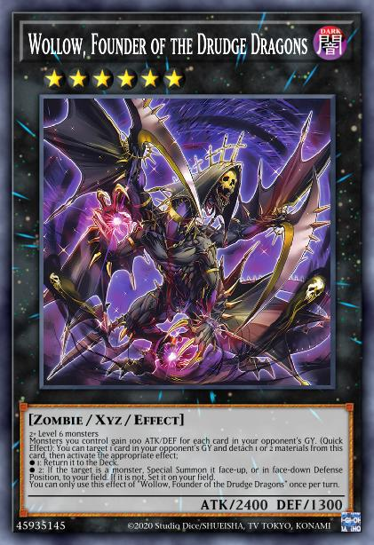
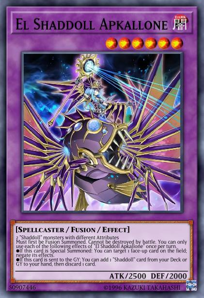
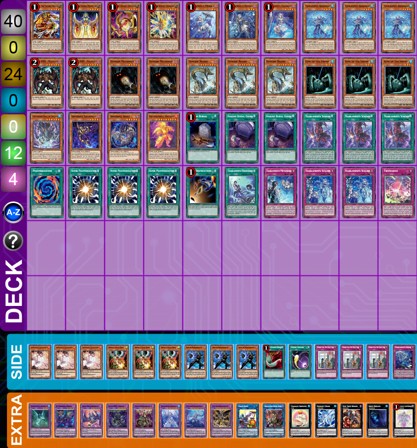
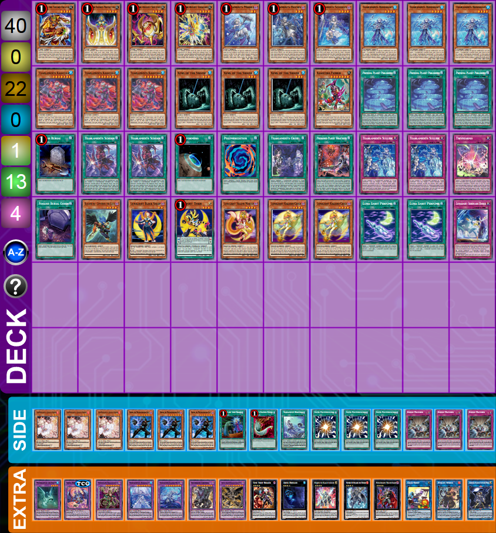
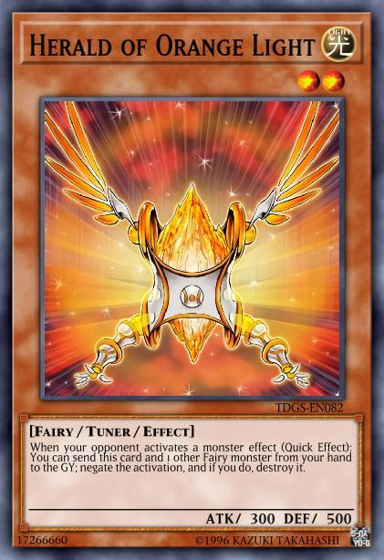
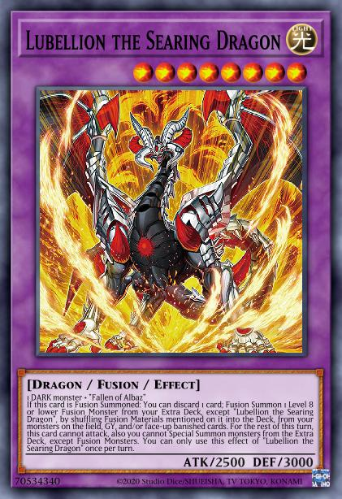
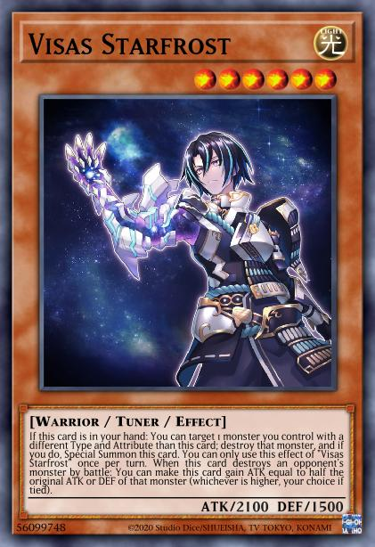
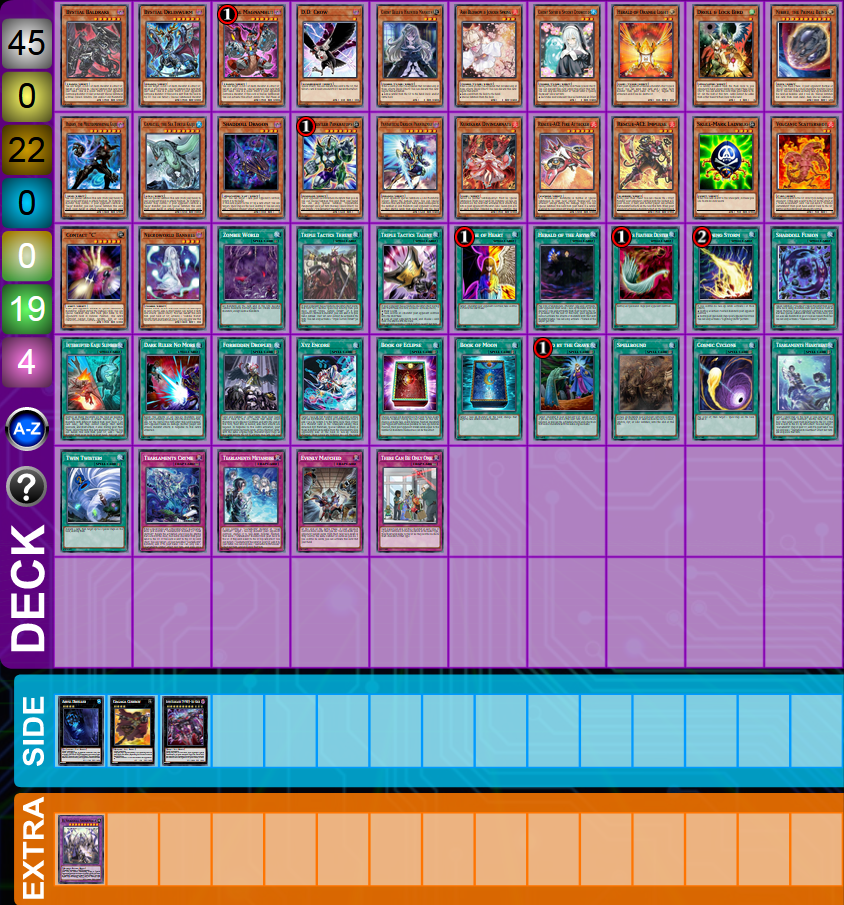

# 

**This guide is for TCG only.**

**Last update:** 2023-11-29, AGOV format.

- [Why play Tearlaments?](#why-play-tearlaments)
- [Tearlaments core cards breackdown](#tearlaments-core-cards-breakdown)
- Popular versions
  - [King of the Swamp](#king-of-the-swamp-version)
  - [Destiny Heroes - Beatrice](#destiny-hero-version)
  - [Horus](#horus)
  - [Shaddoll](#shaddoll-version)
  - [Revolution](#revolution-version)
- Other versions
  - [Budget](#budget-deck)
  - [Kashtira](#kashtira-version)
  - Less popular versions
    - [Lunalight](#lunalight-deck)
    - [P.U.N.K.](#punk-deck)
    - [Branded](#branded-deck)
    - [Mikanko](#mikanko-package)
    - [Rescue-ACE](#rescue-ace-package)
    - [Blackwing](#blackwing-package)
    - [Highlander](#highlander)
- [Spicy cards](#mainboard-spicy-cards)
- [Sideboard](#sideboard)
- [Combos (videos)](#combos-videos)
- [Test hands (videos)](#test-hands-videos)
- [Examples of endboards (images)](#example-of-endboard)
- [Good targets to side out](#good-targets-to-side-out)
- [How to chainblock](#chainblocking)
- [How to beat Tear](#cards-against-tear)

## Little note before you start reading

All the info you will find here is the result of all my research and testing with this deck. Don't take everything you will read as the absolute truth, but I do believe that most of what is said here is a great start to learn and understand this deck.

This is a very in depth guide, so skip any section you might already know. I have maybe added too much information, but at least I feel that everything I wanted to say is here hehe.

### Support me

☕ If you want to support me: <a href="https://www.buymeacoffee.com/pedroluisbernardos/the-depth-tearlaments-online" target="_blank">https://www.buymeacoffee.com/pedroluisbernardos</a>

### Come play against me at AltF4 :)!

https://www.altf4online.com/

## Why play Tearlaments?

You will enjoy playing Tearlaments if you want to play a strong Tier 1 <strong style="color: #3b729b">WATER</strong>/<strong style="color: #953291">DARK</strong> **Aqua Non-Linear Tool-Box deck**. Given that almost all the cards in the deck are limited, you will need to improvise a lot and play around your own mills and hands. Your [endboards](#example-of-endboard) will always vary depending on the cards you see in your rotation and in the [version](#versions) you are playing. This deck can also be considered as a semi-back-row deck because how strong its Traps are and are always present in your board. In conclusion, you will be always changing your final board depending on the version, on your hand/mills and on your opponent's deck. This gives a lot of flexibility and complexity to the deck. It is not an easy one to learn nor to play, so watch out new players!

## Locks

This deck doesn't lock you on anything.

## Tearlaments core cards breakdown

### The Tear girls

Each girl will allow you to make a fusion using themselves and another card in your hand, field or GY. This is the main idea of this deck:

> You can Fusion Summon 1 Fusion Monster from your Extra Deck, by placing Fusion Materials mentioned on it from your hand, field, and/or GY, including this card from your GY, on the bottom of the Deck in any order.

Don't forget that all the girls are once per turn. So, maximum 3 fusions each turn! This will be easy to remember because they are all limited, but always keep it in mind.

| Quantity | Card | Effect | Comment |
| --- | --- | --- | --- |
| 1 |  | If this card is Normal or Special Summoned: You can send the top 3 cards of your Deck to the GY. If this card is sent to the GY by card effect (except during the Damage Step): You can Fusion Summon 1 Fusion Monster from your Extra Deck, by placing Fusion Materials mentioned on it from your hand, field, and/or GY, including this card from your GY, on the bottom of the Deck in any order. You can only use each effect of "Tearlaments Merrli" once per turn. | Merrli is an okay Normal Summon that will mill you three cards. She is also a Level 2 monster, so you can pitch her with Spright Sprind (you make Sprind with a Link-2). |
| 1 |  | When your opponent activates a monster effect on the field (Quick Effect): You can Special Summon this card from your hand, and if you do, send the top 3 cards of your Deck to the GY. If this card is sent to the GY by card effect (except during the Damage Step): You can Fusion Summon 1 Fusion Monster from your Extra Deck, by placing Fusion Materials mentioned on it from your hand, field, and/or GY, including this card from your GY, on the bottom of the Deck in any order. You can only use each effect of "Tearlaments Havnis" once per turn. | A great Hand Trap that allows turn 0 plays and mill 3. Also, your opponent can't stop the mill once the effect has resolved; the Summon and the mill trigger on the same effect. |
| 1 |  | During your Main Phase: You can Special Summon this card from your hand, and if you do, send 1 monster from your hand to the GY, then, send the top 3 cards of your Deck to the GY. If this card is sent to the GY by card effect (except during the Damage Step): You can Fusion Summon 1 Fusion Monster from your Extra Deck, by placing Fusion Materials mentioned on it from your hand, field, and/or GY, including this card from your GY, on the bottom of the Deck in any order. You can only use each effect of "Tearlaments Scheiren" once per turn. | The best of the sisters. **You want to bait their Ash before playing her. She is very important.** Scheiren gives you a protection from Nibiru (because if they Nib you, you will fuse), is a Tear name that allows your backrow to be online and can do Rank 4 plays. She will not only mill 3 but also send another monster in your hand by effect, so it will activate it's effects when send to the GY. You can also pitch a brick like Malicious, Shyama, a Shuffler... Finally, your opponent can't stop the mill once the effect has resolved; the Summon and the mill trigger on the same effect.  One interesting play that you can do with Scheiren and TKash if you don't have any other monsters in hand is to activate the effect of Scheiren (*cl1*) and then TKash (*cl2*). First you will banish something to Summon TKash. Then, Scheiren checks if you have a monster on activation (so it was ok when you activated it, you had TKash), but now, since you have no monsters in hand, Scheiren will just Summon and will not mill since you can't discard any monster. This interaction is due to the **then** in this sentence: `Special Summon this card from your hand, and if you do, send 1 monster from your hand to the GY, then, send the top 3 cards of your Deck to the GY` |

### The other Tear monsters

| Quantity | Card | Effect | Comment |
| --- | --- | --- | --- |
| 2-3 |  | If this card is Normal or Special Summoned: You can send 1 "Tearlaments" monster from your Deck to the GY, except "Tearlaments Reinoheart". If this card is sent to the GY by card effect: You can Special Summon this card (but banish it when it leaves the field), and if you do, send 1 "Tearlaments" monster from your hand to the GY. You can only use each effect of "Tearlaments Reinoheart" once per turn. | A great Normal Summon that can pitch a girl or for TKash if you have nothing else to send. He can revive himself when he's milled (and be banished after), this lines comes up a lot when you are trying to make Rank 4 plays.  **Free Reino revive without discarding:** Reino only checks if you have Tear cards to discard on activation. If on resolution you don't have any Tear card to discard, the effect will still resolve. So, for example, you mill Reino, you only have a TKash as your only Tearlaments card in hand. You can *cl1* Reino, *cl2* TKash. TKash will be Summoned first, then Reino. If you dont have any other Tearlaments cards in hand, you will not need to discard anything because of Reino. He only checks if you have something to discard on activation. Be careful in the case you only have TKash in hand, and you mill for example Reino and Sulliek. If you do *cl1* Reino, *cl2* Sulliek and *cl3* TKash. You will need to discard the card searched by Sulliek because when Reino arrives on the field you have a Tear card to discard.  **Avoid Reino banish:** if you use Reino effect to revive, he will Normally be banished when he leaves the battlefield: `If this card is sent to the GY by card effect: You can Special Summon this card (but banish it when it leaves the field).` But, if you use him for a Rank 4 play, he will not be banished. |
| 3 |  | During the Main Phase (Quick Effect): You can Special Summon this card from your hand, and if you do, banish 1 "Kashtira" or "Tearlaments" card from your hand or GY. If this card is Normal or Special Summoned: You can send the top 3 cards of either player's Deck to the GY. If this card is sent to the GY by card effect: You can send the top 2 cards of your Deck to the GY. You can only use each effect of "Tearlaments Kashtira" once per turn. | Havnis 2.0. TKash allows turn 0 plays and is great to give consistency to this deck: you will mill on Summon and when sent to GY. It is also searchable with Fenrir. The only problem is that is not an Aqua nor a DARK monster.  Always banish a Trap as soon as possible with TKash if you are playing Grief: if you banish a Trap with TKash and you mill Grief, that Trap will return to your hand: `If this card is sent to the GY by card effect: You can target 1 of your banished "Tearlaments" Traps; add it to your hand.` But be careful if you are playing Heartbeat which returns a Trap from the GY to the hand!  Please read TKash and don't give information to your opponent for free. TKash banishes a card if it is Summoned. You don't need to banish when you activate its effect in your hand; so don't give information for free.  If you expect your opponent is playing Aussa the Earth Charmer, Immovable, banish Fenrir with TKash; you don't want to give your opponent a free Fenrir. |

#### Reino or Diviner? Which one to Summon?

Normally, you normal Reino. Even if he is negated, you will have a Tear name to activate your Spell/Traps and he is a Level 4 for your Xyzs. You would like to make Diviner when you can for example go for a Sprind play.

#### Which girl to send?

First, you never want to send Scheiren because you want to activate her effect by using Redoer. Then, if you are asking yourself who to send with Reino, the answer is quite simple: send Merrli if you don't play or don't think you'll need to make Sprind during that turn. If you want to make it, send Havnis. This may not be true in some very niche situations (for example, you are playing Sprind and you know your opponent has Belle, and you can make Cross-Sheep to revive Merrli and then mill 3), but in general this is the good way of thinking.

### The Tear Spell/Trap

| Quantity | Card | Effect | Comment |
| --- | --- | --- | --- |
| 3 I've seen some people saying that 2 is better but I am 101% against that. 3 is just too good |  | When this card is activated: You can add 1 "Tearlaments" monster or 1 "Visas Starfrost" from your Deck to your hand. Fusion Monsters and "Tearlaments" monsters you control gain 500 ATK. If a "Tearlaments" monster(s) you control or in your GY is shuffled into the Deck or Extra Deck (except during the Damage Step): You can target 1 card on the field; destroy it. You can only use this effect of "Primeval Planet Perlereino" once per turn. You can only activate 1 "Primeval Planet Perlereino" per turn. | Perlereino is one of the best cards in this deck. It gives your Tear AND Fusion monsters an ATK boost, it searches when you activate it and can pop one card each turn. Your principal search target will be Scheiren but sometimes it will be better to search for Reino or even TKash. |
| 2-3 |  | If a monster(s) is Normal or Special Summoned, and you control a "Tearlaments" monster or "Visas Starfrost" (except during the Damage Step): You can send the top 3 cards of your Deck to the GY, also, for the rest of this turn, all monsters your opponent controls lose 500 ATK. If this card is sent to the GY by card effect: You can add 1 "Tearlaments" Trap from your Deck to your hand. You can only use each effect of "Tearlaments Scream" once per turn. | Scream will help a lot with the consistency of your deck. It will allow you to mill 3 cards each turn. You will also use it as your principal [chainblocker](#chainblocking) for your Normal Summons. You always want to see it, and even if you mill it, you are still gaining some advantages. The ATK modifier is also very relevant in lots of cases. |
| 0-1 |  | Special Summon 1 "Tearlaments" monster or "Visas Starfrost" from your Deck or GY, then send 1 monster you control to the GY, with the same Type or Attribute as that Special Summoned monster. If this card is sent to the GY by card effect: You can target 1 of your banished "Tearlaments" Traps; add it to your hand. You can only use 1 "Tearlaments Grief" effect per turn, and only once that turn. | Grief is a Monster Reborn or a Foolish Burial in one card. It seems pretty great, but the problem is that you need to send one card with the same type or attribute from the tutored card, so in general you will send the same card you selected. It is also a good card to send to the GY, specially after banishing a Trap with TKash.  A little tip if you really want to mill and have already a Reino: you can Summon TKash with Grief and then send Reino to GY since they are both WATER.  Another nice interaction is to Special Summon Merrli and send form the field Havnis or Scheiren. Then you *cl1* Merrli and *cl2* the other girl to mill 3 then fuse. |
| 0-1 |  | Target 1 Spell/Trap on the field, ~~or you can target 2 if you control "Visas Starfrost"~~; shuffle them into the Deck, then send 1 card from your hand to the GY. If this card is sent to the GY by card effect: You can target 1 "Tearlaments" Trap in your GY; add it to your hand. You can only use 1 "Tearlaments Heartbeat" effect per turn, and only once that turn. | Heartbeat is a Spell/Trap removal that discards a card as effect (so it will trigger in the GY). It is great in the mainboard because it helps you unbricking your hand. Also, another crazy point of this card is that you shuffle back the card you target, so you don't give advantage to your opponent by sending it GY for example. |
| 2-3 |  | If you control a "Tearlaments" monster or "Visas Starfrost": You can target 1 Effect Monster your opponent controls; negate its effects, then send 1 monster you control to the GY. If this card is sent to the GY by card effect: You can add 1 "Tearlaments" monster from your Deck to your hand. You can only use each effect of "Tearlaments Sulliek" once per turn. | Probably the best Trap this deck could have; Sulliek **permanently** negates one Monster each turn, and sends **any one monster from your field** to the GY to activate its effect. Additionally, it tutors a Monster when sent to the GY. |
| 0-1 |  | If you control a "Tearlaments" monster or "Visas Starfrost": Target 1 face-up monster your opponent controls; change it to face-down Defense Position, then send 1 "Tearlaments" monster from your Deck to the GY. If this card is sent to the GY by card effect: You can target 1 "Tearlaments" monster in your GY; add it to your hand. You can only use 1 "Tearlaments Metanoise" effect per turn, and only once that turn. | Book of Moon + Foolish Burial + Monster Reincarnation when sent to the GY. This card is great to stop your opponent from going into Synchro, Xyz and Link plays (they will still be able to fuse using the face-down monster). |
| 0-1 Normally in the side |  | When a Spell/Trap Card, or monster effect, is activated, while you control a "Tearlaments" monster or "Visas Starfrost": Negate the activation, and if you do, shuffle that card into the Deck, then send 1 monster from your hand to the GY. If this card is sent to the GY by card effect: You can target 1 of your banished "Tearlaments" monsters; add it to your hand. You can only use 1 "Tearlaments Cryme" effect per turn, and only once that turn. | Cryme is an omni-negate with counter-trap speed (so your opponent can only chain to this activation with other counter-traps only) that discards a card as effect (so it will trigger in the GY). This trap can also recycle your banished Tear names (for example if you are playing against Bystials or your Runick opponent was lucky). Normally, you want to search this with Kaleido-Heart on turn 1 and set it. |

#### Sometimes is better to not play Scream when you have Scheiren in hand

Let's say you have Mudora, Scheiren, Scream and two other cards in hand. You have two choices here:

- Activate Scream. Then, activate Scheiren. You will mill 6. **But**, if you mill Reino, you will not be able to Special Summon him.
- Activate Scheiren. You mill 3. **You hit Reino**. So you activate his effect by pitching Scream, and continue.

In general, in this situation, I think that if you can play without that Reino, just go and activate Scream. But if Reino is really important, keep it. If for example, you had an Agido instead of the Mudora, because you will mill 8 instead of 3, I would have kept the Scream in hand.

### The Extra-deck monsters

| Quantity | Card | Effect | Comment |
| --- | --- | --- | --- |
| 1-*2* In general 1 |  | "Tearlaments Reinoheart" **or** "King of the Swamp" + 2 Aqua monsters. Cannot be used as Fusion Material. If this card is Special Summoned, or if an Aqua monster is sent to your GY by card effect while this card is on the field: You can target 1 card your opponent controls; shuffle it into the Deck. If this card is sent to the GY by card effect: You can Special Summon this card, and if you do, send 1 "Tearlaments" card from your Deck to the GY. You can only use each effect of "Tearlaments Kaleido-Heart" once per turn. | The most terrifying monster to play against. Kaleido can spin any card on Summon or when he revives and can also send any Tear card from your deck to your GY. You can for example make Kaleido during your turn, kill it with Perlereino, then revive it and send Scream or Sulliek to have access to any card in your deck.  Don't forget that you can make it with any Aqua monster (like Toad or Gameciel). Also, you can make it with two Kings; one being Reino and the other the Aqua monster.  Finally, don't forget no one can fuse with it. So if your opponent plays Fallen of Albaz or Super Poly they will not able to remove it. The same is for you, if you want to spin it back to the extra deck, you'll need a Shuffler or Metanoise.  Some people play 2 Kaleido. This is very very strong in grindy games. Many people will not expect it and you will gain such a huge advantage by doing so. |
| 1 |  | 2 monsters with the same Attribute but different Types. Your opponent cannot target this card, or monsters on the field with the same Attribute as this card, with card effects. Once per turn (Quick Effect): You can declare 1 Attribute; this card becomes that Attribute until the end of this turn. | Mostly a Super Poly target, but can also help to protect your DARK monsters or even make Toad with Reino. |
| 1 I've seen lists without it, but normally you play it |  | 2 monsters with the same Type and Attribute, but different names. Any battle damage your opponent takes from battles involving this card is doubled. If this card is sent to the GY: You can draw 1 card. You can only use this effect of "Garura, Wings of Resonant Life" once per turn. | This is mostly a Super Poly target. Can also help in very niche circumstance to make Beatrice. Don't forget that when it attacks the opponent it has doubled attack (Perlereino, Wraitsoth and Cross-Sheep modify it). |
| 1 |  | 1 Fusion Monster + 1 DARK monster. Once per turn (Quick Effect): You can target 1 face-up monster your opponent controls; place 1 Predator Counter on it, and if it is Level 2 or higher, it becomes Level 1 as long as it has a Predator Counter. Negate the activated effects of your opponent's monsters that have Predator Counters. | Another Super Poly target, but can also be made to kill Xyz or Spright decks by changing the monster's Level. Don't forget that when Dragostapelia will leave the field the monster will not be negated anymore, but it's Level will still be 1. |
| 1 |  | 2 Effect Monsters. If this card is Link Summoned using a Fusion, Synchro, Xyz, or Link Monster as material: You can target 1 card on the field or in either GY; banish it, also your monsters cannot attack directly this turn. When your opponent activates a card or effect (Quick Effect): You can target 2 face-up monsters on the field, including a monster you control; banish both until the End Phase. You can only use each effect of "S:P Little Knight" once per turn. | The new best generic Link 2. This is a crazy card that can protect your own monsters from target negation/destruction and can reset Baronne de Fleur's negate. It is not mandatory, but certainly very strong in all the decks. |
| 0-1 If you decide to play this, I think that you should add Diviner to your list |  | 2 monsters with different names. If a monster is Special Summoned to a zone this card points to: You can apply the following effects, in sequence, based on the card types of the monster(s) this card points to. ~~● Ritual: Draw 2 cards, then discard 2 cards.~~ ● Fusion: Special Summon 1 Level 4 or lower monster from your GY. ● Synchro: All monsters you control gain 700 ATK. ● Xyz: All monsters your opponent controls lose 700 ATK. You can only use this effect of "Cross-Sheep" once per turn. | The main purpose of this card is to make a fusion during your opponent's turn under its arrows to then revive Reino or Diviner, and then mill (and continue your plays). See the combo in the [combo section](#example-of-endboard-with-cross-sheep-and-redoer). It can also be used as the Link 2 to make Sprind.  The ATK modification by pointing to a Synchro or a Xyz will happen sometimes when searching for lethal or trying to out a big monster by battle, don't forget that it is always available. |
| 0-1 |  | 2 monsters, including a DARK monster. ~~(This card is always treated as a "Familiar-Possessed" card.)~~ You can target 1 DARK monster in your opponent's GY; Special Summon it to your zone this card points to. If this Link Summoned card is destroyed by battle, or is destroyed by an opponent's card effect while in its owner's Monster Zone: You can add 1 DARK monster with 1500 or less DEF from your Deck to your hand. You can only use each effect of "Dharc the Dark Charmer, Gloomy" once per turn. | If you play against a DARK deck, Dharc is insane to take any strong monster they have.  If you are playting Bystials or Destrudo, don't forget that you can special summon their Magnamut to grant you a search.  Dharc is also often used to make Sprind because it is a Link 2.  The tutor effect will not happen often, but if it does, you can maybe add: Havnis, Scheiren, Malicious, Mothman, Squamata or Falco for example. |
| 0-1 If you decide to play this, you need to add Dharc or Cross-Sheep at least to your list. If you don't you can't do Sprind in a consistent way |  | 2 monsters, including a Level/~~Rank~~/Link 2 monster. Cannot be used as Link Material the turn it is Link Summoned. You can only use 1 of the following effects of "Spright Sprind" per turn, and only once that turn. If this card is Link Summoned: You can send 1 Level 2 monster from your Deck to the GY. If another monster is Special Summoned while this card is on the field (except during the Damage Step): You can detach 1 material from an Xyz Monster you control, then target 1 monster on the field; return it to the hand. | Mostly here to pitch Merrli, but can also be useful with your Xyz monsters to bounce your opponent'sm monsters. |
| 0-1 You want to chose a Rank 4 that detaches as effect. Time Thief has more effects than Dempsey, but Dempsey stays on field (so you can make S:P with it). It is also not mandatory, you can play none |   | 2 Level 4 monsters. Once per turn, during the Standby Phase: You can attach the top card of your opponent's Deck to this card as material. (Quick Effect): You can detach up to 3 different types of materials from this card, then apply the following effect(s) depending on what was detached. ● Monster: Banish this card until the End Phase. ● Spell: Draw 1 card. ● Trap: Place 1 face-up card your opponent controls on the top of the Deck. You can only use this effect of "Time Thief Redoer" once per turn.  2 Level 4 monsters. ~~If this card is Special Summoned: You can take 1 Level 4 or lower FIRE Warrior monster or 1 "Battlin' Boxing" Spell/Trap from your Deck, and either add it to your hand or send it to the GY.~~ (Quick Effect): You can detach 1 material from a monster you control, and if you do, apply the following effect. ● Your opponent cannot target "Battlin' Boxer" monsters you control with card effects for the rest of this turn. You can only use each effect of "Battlin' Boxer King Dempsey" once per turn. | **Redoer** Your best Rank 4 monster that will trigger Scheiren fusion (because it sends as an effect). You can steal important combo pieces from your opponent's deck, and can trigger Scheiren during your opponent's turn. **Don't steal your opponent's cards. Always check before pickup up your cards.**  **Dempsey** It's effect is not relevant. The only thinking behind it is that it will trigger Scheiren and it stays to make S:P. |
| 1 Sometimes in the side, sometimes in the mainboard |  | 2 Level 4 monsters. While this card has a material attached that was originally WATER, all WATER monsters you control gain 500 ATK. Once per turn (Quick Effect): You can detach 1 material from this card; your opponent cannot activate any card effects in their GY this turn. | Great card to counter decks that play a lot from their GY such as Tearlaments, Drytron, Unchained, etc. You can always make it during your turn to shut down the effects that your Millers would trigger in your opponent's GY. |
| 0-1 Sometimes in the side, sometimes in the mainboard |  | ~~2 Level 12 monsters.~~  During the turn, or turn after, your opponent Special Summoned 2 or more monsters from the Extra Deck, you can also Xyz Summon this card by using 1 monster you control with the highest ATK (your choice, if tied). (Transfer its materials to this card.) If you do, you cannot Normal or Special Summon monsters for the rest of this turn. While this Xyz Summoned monster is on the field, neither player can activate the effects of monsters with 3000 or more ATK. Once per turn: You can detach 1 material from this card; return 1 monster from the field to the hand. | Very good going 2nd monster that can break boards easily. |

#### Baronne package

Normally, all the decks run at least one omni negate monster. Baronne could be a good option.

| Quantity | Card | Effect | Comment |
| --- | --- | --- | --- |
| 1-2-3 |  | If this card is Normal or Special Summoned: You can send 1 Fairy monster from your Deck or Extra Deck to the GY, and if you do, increase this card's Level by that monster's Level, until the end of this turn. If this card is Tributed: You can Special Summon 1 Level 2 or lower Fairy monster from your hand or Deck, except "Diviner of the Herald". You can only use each effect of "Diviner of the Herald" once per turn. | Good Normal Summon that can send a Miller and become Level 6. You can then make Baronne with a Level 4 or Beatrice with a Level 6. If it gets negated, you can use it to make Sprind and then send Merrli.  You can send another Diviner to make Rank 4 plays.  The tribute effect would only matter if you are playing Herald of Orange Light. |
| 0-1 This card is a free Baronne, I really believe that you need it if you play de Fleur |  | If this card is in your hand or GY: You can pay half your LP, then target 1 Level 6 or lower monster you control; Special Summon this card, and if you do, this card's Level is reduced by the Level of the targeted monster, also place this card on the bottom of the Deck if it leaves the field. You can only use this effect of "Destrudo the Lost Dragon's Frisson" once per turn. | The best card to lose on time. Also a great tuner that can be revived from the GY (or can even make Mudragon). You can see the combos [in the combo section](#destrudo-in-gy-combo). |
| 1 |  | 10 stars. 1 Tuner + 1+ non-Tuner monsters. Once per turn: You can target 1 card on the field; destroy it. Once while face-up on the field, when a card or effect is activated (Quick Effect): You can negate the activation, and if you do, destroy that card. You can only use the previous effect of "Baronne de Fleur" once per turn. Once per turn, during the Standby Phase: You can target 1 Level 9 or lower monster in your GY; return this card to the Extra Deck, and if you do, Special Summon that monster. | Incredible omni-negate that can pop your own cards to extend your plays. Also, once you have used your omni, you can revive any important monster in your GY (except Grapha) to continue your plays. |

#### Toad package

Normally, all the decks run at least one omni negate monster. Toad could be a good option. For this package you need to play some Dark monsters to access more easily Mudragon. So, they could be for example the Destiny Hero package, some Bystials, Radian, some Shaddolls, etc.

| Quantity | Card | Effect | Comment |
| --- | --- | --- | --- |
| 0-1 For a better consistency, if you play this, play 2 Reinos |  | If this card is sent to the GY by a card effect: You can Special Summon this card, but banish it when it leaves the field. You can only use this effect of "Night Sword Serpent" once per turn. | Great extender to go for Toad or Link plays. Could be a brick, that's why many people don't run it. |
| 1 |  | 2 Level 4 WATER monsters. Once per turn: You can detach 1 material from this card; Special Summon 1 Rank 3 or lower WATER Xyz Monster from your Extra Deck. This card cannot attack for the rest of this turn. | Make it with two Reinos or Reino and Mudragon. Note: you can't attack then activate its effect. |
| 1 |  | ~~2 Level 2 Aqua monsters.~~ Once per turn, during the Standby Phase: You can detach 1 material from this card; Special Summon 1 "Frog" monster from your Deck. Once per turn, when your opponent activates a Spell/Trap Card, or monster effect (Quick Effect): You can send 1 Aqua monster from your hand or face-up field to the GY; negate the activation, and if you do, destroy that card, then you can Set it to your field. If this card is sent to the GY: You can target 1 WATER monster in your GY; add it to your hand. | Great omni. It's an Aqua so it can be used to make Kaleido. Also, when it dies, it will recycle TKash or Reino. Finally, since Bahamuth is not a threat, if it's still alive on your turn and you shuffled back Toad, you can make it again. |

#### Perlereino/Baronne pop your own cards

During your turn, you can always pop your own cards to maximize your effets.

The easiest card to pop is Kaleido-Heart, because he will then return and mill a Tear card. Normally you will send Scream, to search for any Trap in your deck.

Be careful if you just summoned Kaleido under Cross-Sheep and want to pop it. You **need** to chain Cross-Sheep on *cl2* and Perlereino on *cl1* because if you don't, Kaleido will not be there when Cross-Sheep will check if there is a monster under its arrow.

### Ishizus

| Quantity | Card | Effect | Comment |
| --- | --- | --- | --- |
| 1 I've seen lists without it, but normally you play it |  | You can discard 1 other EARTH Fairy monster; Special Summon this card from your hand, ~~then you can place 1 "Gravekeeper's Trap" from your Deck face-up in your Spell & Trap Zone.~~ (Quick Effect): You can banish this card from your field or GY, then target up to 3 cards in any GY(s), ~~or up to 5 if "Exchange of the Spirit" is on your field or in your GY~~; shuffle them into the Deck. You can only use each effect of "Mudora the Sword Oracle" once per turn. | The worst of the Shufflers. Mudora is good to discard your Millers and to shuffle back cards from the GY. |
| 1 |  | You can discard 1 other EARTH Fairy monster; Special Summon this card from your hand, then add 1 "Exchange of the Spirit" or 1 card that mentions it from your Deck to your hand. (Quick Effect): You can banish this card from your field or GY, then target up to 3 cards in any GY(s), ~~or up to 5 if "Exchange of the Spirit" is on your field or in your GY~~; shuffle them into the Deck. You can only use each effect of "Keldo the Sacred Protector" once per turn. | Keldo is like a better Mudora. When you activate it's effect in hand you need (mandatory) to search for another Ishizu monster; I would recommend to get Kelbek for another interaction or Mudora so you have more chances by milling the other Miller. |
| 1 |  |  If a card(s) is sent from the hand or Deck to your opponent's GY (except during the Damage Step): You can Special Summon this card from your hand, then you can Special Summon 1 Level 4 EARTH Fairy monster from your GY, except "Agido the Ancient Sentinel". If this card is sent from the hand or Deck to the GY: You can activate this effect; each player sends the top 5 cards of their Deck to the GY (or their entire Deck, if less than 5), ~~then, if "Exchange of the Spirit" is in your GY, you can send 5 more cards from the top of either player's Deck to the GY~~. You can only use each effect of "Agido the Ancient Sentinel" once per turn. | The worst of the Millers. It can monster reborn another Ishizu to make Rank 4 plays, but it's mostly useful when sent to the GY to mill 5. |
| 1 |  | If a card(s) is sent from the hand or Deck to your opponent's GY (except during the Damage Step): You can target 1 Special Summoned monster your opponent controls; Special Summon this card from your hand, then return that monster to the hand. If this card is sent from the hand or Deck to the GY: You can activate this effect; each player sends the top 5 cards of their Deck to the GY (or their entire Deck, if less than 5), ~~then, if "Exchange of the Spirit" is in your GY, you can Set 1 Trap from your GY~~. You can only use each effect of "Kelbek the Ancient Vanguard" once per turn. | Kelbek has a crazy effect in hand and when sent to the GY. It is clearly the best of the Ishizu cards. Use it wisely, sometimes it's better to return a monster to the hand to interrupt your opponent's plays instead of milling 5. |

#### Your Millers will trigger even if they are discarded as cost

The cards say: `If this card is sent from the hand or Deck to the GY`. So if you respect this condition, even if you discarded as cost (like by using Super Poly), they will mill 5.

#### Your Miller's effect on the GY will trigger the effect of the other Miller in hand

Since, you force your opponent to send a card from his deck to the GY and your Millers say: `If a card(s) is sent from the hand or Deck to your opponent's GY (except during the Damage Step)`, once you activate for example Agido, you would be able to chain Kelbek in hand.

#### Shuffle your deck when your girls are in the bottom

Wait until your names are in the bottom to shuffle your deck. You have many ways to shuffle it: Malicious, Beatrice, Shufflers, Trivikarma, Reino, Terraforming, Foolish, Foolish Goods... This is mostly important when you make Garura with two girls or when you make two fusions back-to-back. You need to put the girls back in any order in your deck; if they are in the bottom you know you will never see them anymore.

#### If you use your Shufflers try to go to 3 cards even if you have nothing to select

Let's say for example that you want to shuffle back your Reino in your GY (and nothing else), and your opponent has nothing good in his GY. You can always shuffle back useless cards to hurt the consistency of their deck.

### The staples and bricks

| Quantity | Card | Effect | Comment |
| --- | --- | --- | --- |
| 1 Some people play this without Winda just for the draw |  | ~~FLIP: You can draw 2 cards, then discard 1 card.~~ If this card is sent to the GY by a card effect: You can draw 1 card. You can only use 1 "Shaddoll Beast" effect per turn, and only once that turn. | Use it to [chainblock](#chainblocking) Belle or Ash. Also, in hand, it's very useless. You will never set it, but maybe if it happens it can help you. |
| 0-1-2-3 |  | You can target 1 LIGHT or DARK monster in either GY; banish it, and if you do, Special Summon this card from your hand. This is a Quick Effect if your opponent controls a monster. If this card is sent from the field to the GY: You can target 1 Special Summoned monster your opponent controls; send it to the GY. You can only use each effect of "Bystial Druiswurm" once per turn. | Depending on the meta, this can be very good mainboard. But normally, you play it side. It is also a Level 6 so it helps if you play the [Destiny HERO package](#destiny-hero-version). |
| 0-1 Normally in the side |  | You can target 1 LIGHT or DARK monster in either GY; banish it, and if you do, Special Summon this card from your hand. This is a Quick Effect if your opponent controls a monster. If this card is Special Summoned: You can activate this effect; during the End Phase of this turn, add 1 Dragon monster from your Deck or GY to your hand, except "Bystial Magnamhut". You can only use each effect of "Bystial Magnamhut" once per turn. | Depending on the meta, this can be very good. It is also a Level 6 so it helps if you play the [Destiny HERO package](#destiny-hero-version). |
| 1 |  | Send 1 monster from your Deck to the GY. | Mandatory card. This is just too good to start with and send Agido. You can also send any other monster of your deck depending of the situation. |
| 0-1-*2-3* Some people play 2-3 but I think that 0-1 is enough |  | Send 1 Spell/Trap from your Deck to the GY. You can only activate 1 "Foolish Burial Goods" per turn. | This card is great because it can send Trivikarma and then you get whatever you need. The only problem is that it is once per turn. Also, it is quite bad under Shifter, and it has less targets if you don't play Metanoise (but stills very strong). |
| 0-1 |  | Add 1 Field Spell from your Deck to your hand. | Free Perlereino. This is technically a worst version of Foolish Burial Goods, but at least it works under Shifter. |
| 1 I've seen lists without it, but normally you play it |  | ~~Target 1 "Visas Starfrost" in your Monster Zone and 1 Effect Monster your opponent controls; negate that opponent's monster's effects, and if you do, your targeted monster gains ATK equal to half of that monster's original ATK or DEF (whichever is higher).~~ You can banish this card from your GY; add 1 Spell/Trap that mentions "Visas Starfrost" from your Deck to your hand, except "Trivikarma". You can only use 1 "Trivikarma" effect per turn, and only once that turn. | This allows you to shuffle back your deck when you want to remove your girls from the bottom, and also, searches almost any Spell/Trap you need. You will never use the first effect, unless you play Visas, so this card is a brick in hand (but there are many ways to discard it). |

### Core

These are the core cards for the deck. Now you will need to chose the omni in the extra deck (Toad, Baronne or both) and also a main version (explained in the next section).

This is just an example of core too, don't follow this as the absolute truth, for example, many people don't play Bystials, Scattershot, others play Heartbeat mainboard, other don't play Dweller in the main, etc.

## Main versions and packages

For most of the versions here the sideboard is pretty generic. It can be modified depending on the meta.

### King of the Swamp version

This was the old version played during the Kashtira format. It is still very good but some people started cutting the King because it can brick sometimes.

| Quantity | Card | Effect | Comment |
| --- | --- | --- | --- |
| You normally want between 2-3 in this list |   | This card can be used as a substitute for any 1 Fusion Material whose name is specifically listed on the Fusion Monster Card, but the other Fusion Material(s) must be correct. You can discard this card to the Graveyard; add 1 "Polymerization" from your Deck to your hand.  You can substitute this card for any 1 Fusion Material Monster. When you do this, the other Fusion Material Monster(s) must be the correct one(s). | Both are good to be used as fusion substitutes (except for contact fusions). King is great because it helps you getting your Poly, but Beastking is great because it is a Level 4. KotS is more popular and is played more, but I wanted to let you know that both are viable choices if you want this package. |
| 1 |  | Fusion Summon 1 Fusion Monster from your Extra Deck, using monsters from your hand or field as Fusion Material. | Great card to unbrick some hands and make Guardian Chimera. Do not forget that it will triger the effect of the Tear monsters, the Millers, the Shaddolls, etc.  You don't play it if you play Beastking over KotS. |
| 1 |  | ~~"Tearlaments Kitkallos"~~ "King of the Swamp" + 1 "Tearlaments" monster. Other Aqua monsters you control cannot be destroyed by battle. You can only use each of the following effects of "Tearlaments Rulkallos" once per turn. When your opponent activates a card or effect that includes an effect that Special Summons a monster(s) (Quick Effect): You can negate the activation, and if you do, destroy it, then, send 1 "Tearlaments" card from your hand or face-up field to the GY. If this Fusion Summoned card is sent to the GY by a card effect: You can Special Summon this card. | Rulkallos has an included Solemn Warning that makes her terrifing. To use it you need to pitch one card from your **hand or face-up field**. For example, a cool interaction could be to pitch your Sulliek (after you use it if it's on field) to search for TKash or even Havnis to have an extra interaction during your opponent's turn.  She can also revive (only once).  She can also protect your Aqua monsters like Toad, the girls or even a Gameciel your opponent gave you. |
| 1 |  | ~~"Grapha, Dragon Lord of Dark World"~~ "King of the Swamp" + 1 DARK monster. When your opponent activates a monster effect, or a Normal Spell/Trap Card, while you have a card(s) in your hand (Quick Effect): You can activate this effect; the activated effect becomes "Your opponent discards 1 card". You can only use this effect of "Grapha, Dragon Overlord of Dark World" once per turn. If this Fusion Summoned card in its owner's control leaves the field because of an opponent's card: You can Special Summon 1 of your "Grapha, Dragon Lord of Dark World" that is banished or in your GY, then each player with a hand discards 1 card. | Little tip with Grapha: Grapha only checks if you have cards to discard on activation. If on resolution you don't have anything, the effect will still resolve. For example, lets say your hand is only TKash. You can *cl1* Grapha, *cl2* TKash. TKash will be Summoned and Grapha will not discard anything because on activation you respected the conditions.  In the Dark World matchup, you can use their Grapha and one of your DARK monsters to make big Grapha with Super Poly. |
| 1 |  | 3 monsters with different names. Must first be Fusion Summoned using only Fusion Materials from your hand and field, with at least 1 monster from each. If this card is Fusion Summoned by a Spell Card or effect: You can draw cards equal to the number of cards used as material from the hand, and if you do, destroy cards your opponent controls equal to the number of cards used as material from the field. You can only use this effect of "Guardian Chimera" once per turn. While "Polymerization" is in your GY, your opponent cannot target this card with card effects. | Principally here to unbrick you when you go first, or to make you win when you are going second. It is also bigger than Grapha and untargetable when Poly is in the GY.  You don't play it if you play Beastking over KotS. |

#### Rulkallos or Grapaha?

Normally, Grapha is better: it is bigger and can negate more things. It also triggers the card you will discard. But, in some cases you will need to do Rulkallos:

- If you will not have a card to discard with Grapha.
- If you have Heartbeat and/or Cryme, and don't have enough cards to discard.
- If you have one of the Spell/Traps that need a Tear name and you don't have a name in board (or Havnis/TKash in hand).
- If you know Rulkallos will be enough and you will gain more advantage of its revive.
- If you need to protect your other Aqua monsters (specially Toad).

### Destiny Hero version

This is the new version players started playing when Unchained started toping. It gives access to Beatrice to foolish any card you want.

| Quantity | Card | Effect | Comment |
| --- | --- | --- | --- |
| 2 |  | You can banish this card from your GY; Special Summon 1 "Destiny HERO - Malicious" from your Deck. | Nothing to say, you need both to make Dangerous. Then, you need to banish one Mali to Summon the other and then make Beatrice with Dangerous and Malicious. Note: if you have one Mali in hand and the other in GY, you will need to fuse using the one in hand. If you don't you will not be able to Summon the one that will be shuffled back. |
| 0-1 |  | If this card is Normal or Special Summoned: You can take 1 of your "Destiny HERO" monsters from your Deck, GY, or that is banished, and place it on top of your Deck. You can only use this effect of "Destiny HERO - Denier" once per turn. If you have a "Destiny HERO" monster on your field or in your GY, other than "Destiny HERO - Denier": You can Special Summon this card from your GY. You can only use this effect of "Destiny HERO - Denier" once per Duel. | This is a good extender. It helps shuffling back your banished Malicious to resummon it again, and it is great with Cross-Sheep. Check the [Denier combo](#denier-power) to understand it more. |
| 1 |  | You can target 1 card you control; destroy it, then you can destroy 1 Spell/Trap on the field. If this card is in your GY: You can target 1 Fiend monster, or 1 Set card, you control; destroy it, and if you do, Special Summon this card, but place it on the bottom of the Deck when it leaves the field. You can only use each effect of "Unchained Soul of Shyama" once per turn. | This is a good extender that helps destroying your own cards to give you value. It can pop your Spell/Traps or Kaleido to trigger the GY effect. Check the [Shyama test hand](#shyama-utility) example to understand it more. |
| 0-1 |  | Fiend monsters you control, except "Fiendish Rhino Warrior", cannot be destroyed by battle or card effects. If this card is sent to the GY: You can send 1 Fiend monster from your Deck to the GY, except "Fiendish Rhino Warrior". You can only use this effect of "Fiendish Rhino Warrior" once per turn. | This is a good extender if you play Shyama **and** Helshaddoll Hollow. |
| 1 I've seen lists without it, but normally you play it |  | 1 "Destiny HERO" monster + 1 DARK Effect Monster. (Quick Effect): You can discard 1 card; send 1 "Destiny HERO" monster from your hand or Deck to the GY, and if you do, "Destiny HERO" monsters you control gain 200 ATK for each "Destiny HERO" monster in your GY until the end of this turn. You can only use this effect of "Destiny HERO - Dangerous" once per turn. | I don't like to use the Quick Effect to get to Malicious since it discards as cost and not as effect, but sometimes you have no choice. |
| 1 |  | 2 Level 6 monsters. ~~You can also Xyz Summon this card by sending 1 "Burning Abyss" monster from your hand to the GY, then using 1 "Dante" monster you control as material. (Transfer its materials to this card.) If Summoned this way, the following effect cannot be activated this turn.~~ Once per turn (Quick Effect): You can detach 1 material from this card; send 1 card from your Deck to the GY. ~~If this card in your possession is destroyed by your opponent's card and sent to your GY: You can Special Summon 1 "Burning Abyss" monster from your Extra Deck, ignoring its Summoning conditions.~~ | You need two Level 6 to make her. Normally you will use Malicious and Dangerous, but know that Garura and Diviner are also Level 6. Her main purpose is to pitch any card that will help you to gain advantage. If you have nothing to pitch, you can keep her materials for Spright Sprind. Also, always remove Dangerous first, it will give you a fusion in your GY in case you need to make Dragostapelia. |
| 0-1 |  | 2+ Level 6 monsters. Monsters you control gain 100 ATK/DEF for each card in your opponent's GY. (Quick Effect): You can target 1 card in your opponent's GY and detach 1 or 2 materials from this card, then activate the appropriate effect; ● 1: Return it to the Deck. ● 2: If the target is a monster, Special Summon it face-up, or in face-down Defense Position, to your field. If it is not, Set it on your field. You can only use this effect of "Wollow, Founder of the Drudge Dragons" once per turn. | Disrupt your opponent's GY. |

### Winda package

You can add Winda to almost any version you want. You normally want Shaddoll Beast, and if you want another one like Squamata or Hollow. It gives access to a strong floodgate that stops Special Summons.

| Quantity | Card | Effect | Comment |
| --- | --- | --- | --- |
| 1 |  | ~~FLIP: You can draw 2 cards, then discard 1 card.~~ If this card is sent to the GY by a card effect: You can draw 1 card. You can only use 1 "Shaddoll Beast" effect per turn, and only once that turn. | Use it to [chainblock](#chainblocking) Belle or Ash. Also, in hand, it's very useless. You will never set it, but maybe if it happens it can help you. |
| 0-1 |  | FLIP: You can target 1 monster on the field; destroy it. If this card is sent to the GY by a card effect: You can send 1 "Shaddoll" card from your Deck to the GY, except "Shaddoll Squamata". You can only use 1 "Shaddoll Squamata" effect per turn, and only once that turn. | It's a brick even when milled if you already milled your Shaddoll Beast. But it is a DARK, so it can help making Mudragon, and it is a Level 4. In worst case scenario, you can set it. |
| 0-1 |  | ~~FLIP: You can target 1 face-up monster your opponent controls; send 1 "Shaddoll" monster with its same Attribute from your Extra Deck to the GY, and if you do, banish that monster.~~ If this card is sent to the GY by card effect: You can send cards from the top of your Deck to the GY, equal to the number of different original Attributes among the monsters on the field. You can only use 1 "Helshaddoll Hollow" effect per turn, and only once that turn. | A better version of Squamata, but it's not a DARK and it's not a Level 4. Also, in hand, it's very useless. You will never set it, but maybe if it happens it can help you. |
| 1 |  | 1 "Shaddoll" monster + 1 DARK monster. Must first be Fusion Summoned. Cannot be destroyed by an opponent's card effects. Each player can only Special Summon monster(s) once per turn while this card is face-up on the field. If this card is sent to the GY: You can target 1 "Shaddoll" Spell/Trap in your GY; add it to your hand. | She can not be destroyed by card effect, and she will block you if you want to Special Summon more than once. Be careful when you play her: the timing is the key. |

### Danger package

Gamble more to gain more consistency to the deck. Allow more Rank 4 and Rank 7 plays. Also, Nessie is an Aqua/Dark so it has many synergies with the girls.

| Quantity | Card | Effect | Comment |
| --- | --- | --- | --- |
| 1-2-3 |  | You can reveal this card in your hand; your opponent randomly chooses 1 card from your entire hand, then you discard the chosen card. Then, if the discarded card was not "Danger! Nessie!", Special Summon 1 "Danger! Nessie!" from your hand, and if you do, draw 1 card. If this card is discarded: You can add 1 "Danger!" card from your Deck to your hand, except "Danger! Nessie!". You can only use this effect of "Danger! Nessie!" once per turn. | Great card to draw or to Summon Mothman from deck. It's also a DARK Aqua Level 7: so you can make Garura and Rank 7 plays with it. |
| 1-2 I've seen some lists with only 1 Nessie and that's it, but I think that at least 1 Mothman is very good |  | You can reveal this card in your hand; your opponent randomly chooses 1 card from your entire hand, then you discard the chosen card. Then, if the discarded card was not "Danger! Mothman!", Special Summon 1 "Danger! Mothman!" from your hand, and if you do, draw 1 card. If this card is discarded: You can have both players draw 1 card, then both players discard 1 card. You can only use this effect of "Danger! Mothman!" once per turn. | It's a DARK Level 4 and can maybe help you getting rid of a brick in hand. It can also get you into Rank 4 plays and Mudragon. |
| 0 |  | If this card is sent to the GY: You can add 1 Level 4 Insect monster from your Deck to your hand, then, if you added a Normal Monster, you can Special Summon it, then you can destroy 1 monster on the field with ATK greater than or equal to that Special Summoned monster's. You can only use this effect of "Gokipole" once per turn. | Some people in the OCG played this with Mothman, but I am not sur of the utility in the TCG. I will still mention it. |

#### Nessie or Mothman first?

Some ways to think it, but it always depends on your build and your board:

- If you don't have another Mothman in the deck, you should use Nessie first, because if you hit Mothman, you will not be able to have it on board. And, if you hit Nessie, nothing will happen.
- If you need a Level 7 to make a Synchro-10 play or you need another Level 7 to make Dracossack, you should do Nessie first.
- If you need to make a Synchro 10 play or you need another Level 4 to make a Rank 4 Xyz, you should do Mothman first.
- If you have another Mothman in the deck, and you have a good card to discard in your hand (like Trivikarma, Malicious, a Shuffler...) you can use Mothman first, because if you hit itself you can always discard that card. But, if you hit Nessie, you will only have a Level 4 in play, a dead card in hand and a draw.
- Do you need a bigger body? If so, you should do Nessie first.

#### Decklists

All of those packages complement well each other and you can mix them. For example:

- Malicious/Shaddoll/any Danger and a Tear girl can make Mudragon to have access to Bahamuth/Toad.
- Beatrice can pitch a Shaddoll to have access to Winda. See the combo in the [combo section](#example-of-endboard-with-beatrice-and-winda).

#### Here are some examples:

##### Beatrice + Winda + Baronne

##### Beatrice + Winda + Baronne + Toad

##### King of the Swamp + Winda + Baronne + Toad

##### King of the Swamp + Winda + Baronne

##### King of the Swamp + Beatrice + Winda + Baronne + Toad

### Horus

| Quantity | Card | Effect | Comment |
| --- | --- | --- | --- |
| 3 |  | If you control "King's Sarcophagus", you can Special Summon this card (from your GY). You can only Special Summon "Imsety, Glory of Horus" once per turn this way. You can only use each of the following effects of "Imsety, Glory of Horus" once per turn. You can send 2 cards from your hand to the GY, including this card; add 1 "King's Sarcophagus" from your Deck to your hand, then you can draw 1 card. If another card(s) you control leaves the field by an opponent's card effect, while this card is in your Monster Zone (except during the Damage Step): You can send 1 card on the field to the GY. | |
| 1 |  | If you control "King's Sarcophagus", you can Special Summon this card (from your GY). You can only Special Summon "Hapi, Guidance of Horus" once per turn this way. If another card(s) you control leaves the field by an opponent's card effect, while this card is in your Monster Zone (except during the Damage Step): You can target 2 cards that are banished and/or in the GYs; either add both to the hand or shuffle both into the Deck. You can only use this effect of "Hapi, Guidance of Horus" once per turn. | |
| 0-1 |  | If you control "King's Sarcophagus", you can Special Summon this card (from your GY). You can only Special Summon "Qebehsenuef, Protection of Horus" once per turn this way. If another card(s) you control leaves the field by an opponent's card effect, while this card is in your Monster Zone (except during the Damage Step): You can activate this effect; this turn, your opponent's monsters cannot target "Horus" monsters for attacks, also your opponent cannot target "Horus" monsters on the field with card effects. You can only use this effect of "Qebehsenuef, Protection of Horus" once per turn. | |
| 0-1 |  | If you control "King's Sarcophagus", you can Special Summon this card (from your GY). You can only Special Summon "Duamutef, Blessing of Horus" once per turn this way. Gains 1200 ATK/DEF for each "Horus" monster you control. If another card(s) you control leaves the field by an opponent's card effect, while this card is in your Monster Zone (except during the Damage Step): You can draw cards equal to the number of monsters with different names in your Main Monster Zone. You can only use this effect of "Duamutef, Blessing of Horus" once per turn. | |
| 1-2-3 |  | "Horus" monsters you control cannot be destroyed by card effects that do not target them. You can send 1 card from your hand to the GY; send 1 "Horus" monster from your Deck to the GY. You can only use this effect of "King's Sarcophagus" up to four times per turn. Once per turn, at the start of the Damage Step, if your "Horus" monster battles an opponent's monster: You can send that opponent's monster to the GY. | |
| 0-1 |  | Fiend monsters you control, except "Fiendish Rhino Warrior", cannot be destroyed by battle or card effects. If this card is sent to the GY: You can send 1 Fiend monster from your Deck to the GY, except "Fiendish Rhino Warrior". You can only use this effect of "Fiendish Rhino Warrior" once per turn. | |
| 1 |  | 2+ Level 8 monsters. ~~If you use a monster(s) with a Level that is owned by your opponent for the Xyz Summon of this card, treat it as Level 8.~~ Neither player can target this card with effects of Special Summoned monsters, except those Special Summoned from the GY. You can detach 1 material from this card; each player sends the top 4 cards from their Deck to the GY, then if any monsters were sent to either GY by this effect, you can Special Summon 1 of those monsters to your field. You can only use this effect of "The Zombie Vampire" once per turn. | This card is the reason why you play Horus. Mill 4 and revive is very strong, but this might be weak against mirror matches. |

### Shaddoll version

The objective of this version is to always garantee a Winda. It takes lots of places on your extra deck, but its pretty consistent. You will play the [Winda package](#winda-package) + some extra cards listed below. See the combo in the [combo section](#shaddoll-combo).

| Quantity | Card | Effect | Comment |
| --- | --- | --- | --- |
| At least one Falco or Diviner:  0-1  0-1-2-3 |   | FLIP: You can target 1 "Shaddoll" monster in your GY, except "Shaddoll Falco"; Special Summon it in face-down Defense Position. If this card is sent to the GY by a card effect: You can Special Summon it in face-down Defense Position. You can only use 1 "Shaddoll Falco" effect per turn, and only once that turn.  If this card is Normal or Special Summoned: You can send 1 Fairy monster from your Deck or Extra Deck to the GY, and if you do, increase this card's Level by that monster's Level, until the end of this turn. If this card is Tributed: You can Special Summon 1 Level 2 or lower Fairy monster from your hand or Deck, except "Diviner of the Herald". You can only use each effect of "Diviner of the Herald" once per turn. | Some people prefer Diviner, some prefer Falco. Diviner is not a brick in hand, but Falco is. You need to choose one to allow your Synchro plays (you will revive the tuner with Cross-Sheep).  Diviner's pros is that is a good Normal Summon that can send a Miller and become Level 6. You can then make Baronne with a Level 4. If it gets negated, you can use it to make Sprind and then send Merrli.  Falco's pros is that is a DARK Shaddoll. |
| 1 |  | During the Main Phase, you can: Fusion Summon 1 "Shaddoll" Fusion Monster from your Extra Deck, by banishing Fusion Materials listed on it from your field or GY, but it cannot attack directly. Then, you can send to the GY 1 monster your opponent controls with the same Attribute as that Fusion Summoned monster. You can only use this effect of "Shaddoll Schism" once per turn. | This will allow you to make Winda during your opponent's turn. It can also be used to remove a monster. |
| 2-3 You can play 1-2 main and the rest side. |  | Fusion Summon 1 "Shaddoll" Fusion Monster from your Extra Deck, using monsters from your hand or field as Fusion Material. If your opponent controls a monster that was Special Summoned from the Extra Deck, you can also use monsters in your Deck as Fusion Material. You can only activate 1 "Shaddoll Fusion" per turn. | Incredible going second card! The best play you can make is to make Shekinaga by foolishing Agido and Beast to draw 1 and mill 5. |
| 1 |  | 2 "Shaddoll" monsters with different Attributes. Must first be Fusion Summoned. Cannot be destroyed by battle. You can only use each of the following effects of "El Shaddoll Apkallone" once per turn. ● If this card is Special Summoned: You can target 1 face-up card on the field; negate its effects. ● If this card is sent to the GY: You can add 1 "Shaddoll" card from your Deck or GY to your hand, then discard 1 card. | You will rarely Summon it. Apkallone is mostly here to be pitched with Granguignol and then tutor a Shaddoll card and pitch a card from your hand (no need to be the same). |
| 0-1 |  | 1 "Shaddoll" monster + 1 LIGHT monster. Must first be Fusion Summoned. If this card is Special Summoned: You can send 1 "Shaddoll" card from your Deck to the GY. At the start of the Damage Step, if this card battles a Special Summoned monster: Destroy that monster. If this card is sent to the GY: You can target 1 "Shaddoll" Spell/Trap in your GY; add it to your hand. | You normally use Grangignol and a Shaddoll monster to make it. And then make Baronne with Falco or Diviner (you revive the tuner with Cross-Sheep). It's effect can also be useful to pitch Helshaddoll and mill a lot or to destroy a monster on field. Don't forget the effect when sent to GY. |
| 1 |  | 1 "Shaddoll" monster + 1 EARTH monster. Must first be Fusion Summoned. When a Special Summoned monster activates its effect while you have a "Shaddoll" card in your hand (Quick Effect): You can negate the activation, and if you do, destroy that monster, then send 1 "Shaddoll" card from your hand to the GY. You can only use this effect of "El Shaddoll Shekhinaga" once per turn. If this card is sent to the GY: You can target 1 "Shaddoll" Spell/Trap in your GY; add it to your hand. | Mostly here to give access the Shaddoll Fusion play with the Millers. It's other effect can also be good, but hard to set-up. Don't forget the effect when sent to GY. |
| 1 |  | ~~"Blazing Cartesia, the Virtuous"~~ "King of the Swamp" + 1 LIGHT or DARK monster. If this card is Fusion Summoned: You can send 1 Level 6 or higher LIGHT or DARK monster from your Deck or Extra Deck to the GY. If a monster is Special Summoned by your opponent's activated monster effect (except during the Damage Step): You can banish this card from your field or GY; Special Summon 1 "Dogmatika" monster from your Deck or 1 "Despia" monster from your Extra Deck. You can only use each effect of "Granguignol the Dusk Dragon" once per turn. | It's only here to pitch Apkallone (or Garura if you have nothing else to pitch). It's also a Level 8 (so can make Baronne with a Level 2) and a Light monster (to make Construct). |

#### Variant

You can also play a small Shaddoll package with only Shekinaga and 3 Shaddoll Fusions in your sideboard:

### Revolution version

This version can almost always guarantee a Field Spell (with Ancient Fairy then Amritara). If you already have enough gas, instead of Amritara you can make Crystal Wing Synchro Dragon to have another negate on board.

It can also make a two card combo with Revolution and Fenrir. See the combo in the [combo section](#revolution-combo).

You can add more spice too, check the [Spicy cards for a more Synchro-heavy deck](#spicy-cards-for-a-more-synchro-heavy-deck) section.

| Quantity | Card | Effect | Comment |
| --- | --- | --- | --- |
| 2-3 |  | If you Synchro Summon a ~~"Power Tool" Synchro Monster or a~~ Level 7 or 8 Dragon Synchro Monster, this card in your hand can also be used as material. You can only use this effect of "Revolution Synchron" once per turn. If you control a Level 7 or higher Synchro Monster while this card is in your GY: You can send the top card of your Deck to the GY, and if you do, Special Summon this card, also its Level becomes 1. You can only use this effect of "Revolution Synchron" once per Duel. | The key card of this version. You use it to make Ancient Fairy Dragon or Baronne (with a Kashtira monster). Then, you can revive it and make Visas, and continue playing... |
| 1-2-3 |  | Add 1 "Synchron" Tuner from your Deck to your hand, then send the top card of your Deck to the GY. | Great card, but plays into Droll. |
| 1 |  | 7 stars. 1 Tuner + 1+ non-Tuner monsters. During your Main Phase: You can Special Summon 1 Level 4 or lower monster from your hand. You cannot conduct your Battle Phase the turn you activate this effect. During your Main Phase: You can destroy as many cards in the Field Zones as possible (min. 1), and if you do, gain 1000 LP, then you can add 1 Field Spell with a different name than the destroyed card(s), from your Deck to your hand. You can only use each effect of "Ancient Fairy Dragon" once per turn. | Great card that can win you the Time and can pop your own Wraitsoth to search for Perlereino. It's also insane against any deck that has field spells like Rescue-Ace, Purrely, Runick or Traptrix for example.  You can activate the effect to Special Summon when going first.  The effect to destroy a Field Spell doesn't target. Also, if there are 2 Field Spell Cards on the field the effect of AFD will destroy both of them. |
| 1 |  | 8 stars. 1+ Tuners + 1 LIGHT monster. This card's name becomes "Visas Starfrost" while on the field. You can only use each of the following effects of "Visas Amritara" once per turn. If this card is Synchro Summoned: You can add 1 Spell/Trap that mentions "Visas Starfrost" from your Deck to your hand. During your Main Phase: You can destroy 1 monster you control, also all Synchro Monsters you control will gain 800 ATK this turn. | This will tutor for almost any Spell/Trap in your deck. This will also give your Heartbeat and Trivikarma an extra effect. Finally, the monster pop might be relevant, don't forget you have it. |
| 1 |  | 8 stars. 1 Tuner + 1+ non-Tuner Synchro Monsters. Once per turn, when another monster's effect is activated (Quick Effect): You can negate the activation, and if you do, destroy that monster, and if you do that, this card gains ATK equal to the destroyed monster's original ATK until the end of this turn. If this card battles an opponent's Level 5 or higher monster, during damage calculation: This card gains ATK equal to the current ATK of the opponent's monster it is battling during that damage calculation only. | This is a monster negate and can battle almost any big monster. |

You can build it in many ways. Here are some examples:

#### Revolution alone

#### Revolution Toad

#### Revolution Shaddoll

### Kashtira version

Other cards like Reiseheart or Theosis make the deck way more explosive, but the mills are very bad. You have to make some choices during your deckbuild. This is an example of the proportions you can run:

| Quantity | Card | Effect | Comment |
| --- | --- | --- | --- |
| 3 |  | If you control no monsters, you can Special Summon this card (from your hand). You can only use each of the following effects of "Kashtira Fenrir" once per turn. During your Main Phase: You can add 1 "Kashtira" monster from your Deck to your hand. When this card declares an attack, or if your opponent activates a monster effect (except during the Damage Step): You can target 1 face-up card your opponent controls; banish it, face-down. | You will need Fenrir and TKash to make Dracossack. You can also play some Nessies to play Dracossack because they are Level 7 too. |
| 1-2 |  | If you control no monsters, you can Special Summon this card (from your hand). You can only use each of the following effects of "Kashtira Unicorn" once per turn. During your Main Phase: You can add 1 "Kashtira" Spell from your Deck to your hand. When this card declares an attack, or if your opponent activates a monster effect (except during the Damage Step): You can look at your opponent's Extra Deck, and if you do, banish 1 monster from it, face-down. | Allows you to search for Birth or Wraitsoth. |
| 0-1 |  | During the Main Phase (Quick Effect): You can Special Summon this card from your hand, and if you do, banish 1 "Kashtira" or "Scareclaw" card from your hand or GY. You can only use this effect of "Scareclaw Kashtira" once per turn. This card can attack while in face-up Defense Position. If it does, apply its DEF for damage calculation. If your "Kashtira" or "Scareclaw" monster battles an opponent's monster, that opponent's monster's effects are negated until the end of this turn. | This helps against untargettable and undestroyable monsters. |
| 1-2-3 |  | When this card is activated: You can add 1 "Kashtira" monster from your Deck to your hand. Monsters you control gain 100 ATK/DEF for each different Attribute on the field. If a "Kashtira Shangri-Ira" you control activates an effect (except during the Damage Step): You can target 1 card on the field; destroy it. You can only use this effect of "Pressured Planet Wraitsoth" once per turn. You can only activate 1 "Pressured Planet Wraitsoth" per turn. | Useful to bait an Ash or to search for Ferir or TKash. It also boosts the ATK **and** DEF, so consider it. Normally, you want to play this before Perlereino. |
| 1-2 |  | You can Normal Summon Level 7 monsters without Tributing. During your Main Phase: You can Special Summon 1 of your non-Xyz "Kashtira" monsters that is banished or in your GY. If your opponent activates a Spell Card or effect, and you control a "Kashtira" monster: You can target 3 cards in your opponent's GY; banish them, face-down. You can only use each effect of "Kashtira Birth" once per turn. | Good card advantage card that allows you to clean your opponent's GY and recurrs your milled or banished Kashtira monsters to put pressure. |
| 1 |  | During each Standby Phase: You can Special Summon 1 "Kashtira" monster from your Deck. You can only use the previous effect of "Kashtira Shangri-Ira" once per turn. Each time a card(s) your opponent owns and possesses is banished face-down (except during the Damage Step): You can choose 1 unused Main Monster Zone or Spell & Trap Zone; it cannot be used while this monster is face-up on the field. If this card on the field would be destroyed by battle or card effect, you can detach 1 material from this card instead. | This is a great boss monster to have in any Kashtira field. |
| 1 |  | 2 Level 7 monsters. Cannot be destroyed by card effects while it has Xyz Material. While this card has Xyz Material, each time your opponent activates a card or effect, inflict 500 damage to your opponent immediately after it resolves. ~~Once per turn, during either player's turn: You can detach 1 Xyz Material from this card, then target 1 "Red-Eyes" Normal Monster in your Graveyard; Special Summon it.~~ | The deck has very big monsters, so you can remove a lot of life points during the battle phase. If you don't kill your opponent, you can just make Red-Eyes and they will kill themselves. |
| 0-1 |  | 3 monsters with different names. If this card was Link Summoned using a Level 7 or higher monster(s) as material, your opponent cannot target it with card effects, also it cannot be destroyed by your opponent's card effects. When this card destroys an opponent's monster by battle: You can activate 1 of these effects; ● This card gains 1500 ATK. ● This card can make a second attack during the Battle Phase of your next turn. ● Banish 1 card on the field. | This is a big tower that most of the matchups can't pass though if you make it with a Level 7 or higher monster. |
| 0-1 |  | 2 Level 7 monsters. Once per turn: You can detach 1 material from this card, then target 1 monster your opponent controls; take control of that monster. This card cannot attack the turn this effect is activated. | Good spice to add to the deck. It can remove annoying monsters. |

### Budget deck

For this version I have cut the big cards: Tearlaments Kashtira, Field Spells, S:P, Fenrir, Diviner and Guardian Chimera.

The deck will not be great because you are missing your Field Spells and TKash but this is the idea.

**To upgrade it**, you can first get one Perlereino (and add Terraforming) and then add three TKash, then the two other Field Spells. Then, if you want to add Baronne, you can purchase one or two Diviners. Fenrir is not needed, and Guardian Chimera is only needed if you play KotS.

---

### Less popular versions

I will present here some other versions that can be played with Tear, but I will not add too much info about those decks. Also, they will not have their combo section unless the version becomes more popular.

These versions are not up-to-date nor tested.

#### Lunalight deck

This version is not very good since the Lunalight cards are pretty old and weak, but it's stills fun to play!

You play this version because `Bujintei Kagutsuchi`.

I'll leave it to you to explore the classic Lunalight combos since this is a Tear guide. But here is an idea of the deck:

#### P.U.N.K. deck

This is a full gas version; more combo, more complicated. I recommend you to understand both versions individually and then try by mixing them.

You play this version because `The Zombie Vampire` and the powerful P.U.N.K. endboard.

I'll leave it to you to explore the classic P.U.N.K. combos since this is a Tear guide. But here is an idea of the deck:

#### Branded deck

I've found no recent builds for a Branded-Tear deck. I managed to build this. I don't know if it's good enough, and it can clearly be refined. I'll leave it to you to explore the classic Branded. combos since this is a Tear guide. But here is an idea of the deck:

I also saw a similar deck to this one finished 4-0 in a locals, I'm sharing it too. It's mostly a Branded Despia deck with a little bit of Tear.

#### Mikanko package

The Mikanko package is mainly here to make Beatrice by using Diviner of the Herald. In this version there is no Winda, but you can easily add it by putting Dweller in the side and adding like one Shaddoll Beast. [You can make Winda easily with Beatrice](#example-of-endboard-with-beatrice-and-winda).

| Quantity | Card | Effect | Comment |
| --- | --- | --- | --- |
| 3 |  | ~~You can Ritual Summon this card with "Mikanko Kagura".~~ Cannot be destroyed by battle, also your opponent takes any battle damage you would have taken from battles involving this card. You can only use each of the following effects of "Ohime the Manifested Mikanko" once per turn. You can reveal this card in your hand; add 1 "Mikanko" card from your Deck to your hand, except "Ohime the Manifested Mikanko", then discard 1 card. ~~(Quick Effect): You can target 1 Equip Spell in your GY; equip it to 1 appropriate monster on the field.~~ | This card will return it to your hand during your opponent's End Phase so you can keep it on field to protect you one turn, or you can make Beatrice and continue your plays from there. |
| 1 |  | Special Summon 1 "Mikanko" monster from your hand, ignoring its Summoning conditions, but return it to the hand during your opponent's End Phase. During your Main Phase: You can banish this card from your GY; send 1 "Mikanko" card from your Deck to the GY, except "The Great Mikanko Ceremony". You can only use each effect of "The Great Mikanko Ceremony" once per turn. | This is here to Summon Ohime. If this goes to your GY, the Ohimes become bricks.  Activate the GY effect as soon as possible to get rid of your bricks, but also use it to shuffle your deck when the girls are in the bottom. |
| 1 |  | ~~1 Tuner + 1+ non-Tuner monsters. Any monster sent from the hand or Main Deck to the GY is banished instead. When a Spell/Trap Card, or monster effect, is activated (Quick Effect): You can Tribute this card; negate the activation, and if you do, destroy that card.~~ If this card is sent to the GY: You can add 1 Ritual Monster or 1 Ritual Spell from your Deck to your hand. | It is mostly here to pitch it with Diviner and search for Ohime. |
| ? |  | When your opponent activates a monster effect (Quick Effect): You can send this card and 1 other Fairy monster from your hand to the GY; negate the activation, and if you do, destroy it. | When the Ishizus were at 3 people played it. If the Ishizus were at 2, I'm sure people would play this too. But today, we don't have enough targets for this. I believe the only version it could have its place is Mikanko, and even there I am not sure. |

#### Rescue-ACE package

This is mostly a 4-card package that can be added to almost any version.

| Quantity | Card | Effect | Comment |
| --- | --- | --- | --- |
| 3 |  | During your Main Phase: You can choose the 1 Effect Monster your opponent controls with the highest ATK (your choice, if tied), and neither player can activate that monster's effects on the field this turn. When your opponent activates a monster effect on the field (Quick Effect): You can Tribute this card from your hand or face-up field; Special Summon ~~1 Machine "Rescue-ACE" monster~~ Rescue-ACE Fire Attacker from your Deck. You can only use each effect of "Rescue-ACE Impulse" once per turn. | This is a great card to chain to any monster effect to Special Summon Fire Attacker.  One play you can do is for example, chain Impulse to Alluber. Impulse will Summon Fire Attacker and then Alluber will be forced to make your opponent add a card to their hand. Now you can activate the Fire Attacker's effect. |
| 1 |  | If ~~a "Rescue-ACE" monster(s)~~ Rescue-ACE Impulse is Normal or Special Summoned to your field, except "Rescue-ACE Fire Attacker" (except during the Damage Step): You can Special Summon this card from your hand. If a card(s) is added to your opponent's hand, except by drawing it (except during the Damage Step): You can draw 2 cards, then discard 1 card. You can only use each effect of "Rescue-ACE Fire Attacker" once per turn. | This is mostly here to made you draw 2 and then discard 1 (and trigger the effect of the discarded card). It is also a Level 6 if you want to make Beatrice with it. |

#### Blackwing package

This version is not very explored. The only content I found online is <a href="https://www.youtube.com/watch?v=6ZISvxyzRv4" target="_blank">this video</a>. I've also tried to make a [comprensible combo tutorial](#blackwing-combo).

You play this version because `Blackfeather Darkrage Dragon`.

This is what the decklist could maybe look like:

#### Highlander

This is not a real version, but if you want to have fun and play a meme deck here you go :)

The card that you might not know is `Supreme Sea Mare`.

## Mainboard spicy cards

### General spicy cards

All those cards are facultative. You can run 0 or the number I precised. I'll not list all the cards that are possible. Some cards such as Nibiru, D.D. Crow, Bystials, Dropplet, any TTT could be here, but I do not need to explain why.

| Quantity | Card | Effect | Comment |
| --- | --- | --- | --- |
| 1 |  | If this card is in your GY: You can return 1 face-up card you control to the hand; Special Summon this card, and if you do, take 400 damage. You can only use this effect of "Blackwing - Zephyros the Elite" once per Duel. | Zephyros is insane to get your Spell/Traps back to your hand once you used their effect on your turn, to discard them with other cards. You can also get back TKash to have it online during your opponent's turns. Another cool play would be to bounce Perlereino, Reino or Diviner so you can activate them again (if they are already on the field from the past turns). It is also a DARK (so you can make Mudragon with it), and a Level 4 (so you can make Rank 4 plays).  Be careful in time! |
| 3 in total |   | You can Special Summon this card (from your hand) to your opponent's field in Attack Position, by Tributing 1 monster they control. If your opponent controls a "Kaiju" monster, you can Special Summon this card (from your hand) in Attack Position. You can only control 1 "Kaiju" monster. ~~When your opponent activates a card or effect, except "Gameciel, the Sea Turtle Kaiju" (Quick Effect): You can remove 2 Kaiju Counters from anywhere on the field; negate the activation, and if you do, banish that card.~~  You can Special Summon this card (from your hand) to your opponent's field in Attack Position, by Tributing 1 monster they control. If your opponent controls a "Kaiju" monster, you can Special Summon this card (from your hand) in Attack Position. You can only control 1 "Kaiju" monster. ~~Once per turn: You can remove 2 Kaiju Counters from anywhere on the field; Special Summon 1 "Radian Token" (Fiend/DARK/Level 7/ATK 2800/DEF 0), but it cannot be used as Synchro Material.~~ | Gameciel is clearly very good because it's has the lowest ATK. It is also an Aqua, so can be used to make Kaleido. Also, if you are playing Toad package you can return this from your GY to your hand when Toad dies. But, I think that Radian is better because it's a DARK and can allow Mudragon plays. |
| 1-2-*3* |  | If you control no monsters, you can Special Summon this card (from your hand). You can only use each of the following effects of "Kashtira Fenrir" once per turn. During your Main Phase: You can add 1 "Kashtira" monster from your Deck to your hand. When this card declares an attack, or if your opponent activates a monster effect (except during the Damage Step): You can target 1 face-up card your opponent controls; banish it, face-down. | If you can't win against Kashtira, join them. You only play this because it's a crazy card to play. It's very strong and can be very good going first or second. You can even topdeck this card and win a game. It has lots of synergies with Tearlaments Kashtira and can allow [Draccossack](#dracossack---cherubini---sprind), [Destrudo](#destrudo-in-gy-combo) or [Revolution Synchron](#revolution-combo) plays. |
| 1 |  | When this card is activated: You can add 1 "Kashtira" monster from your Deck to your hand. Monsters you control gain 100 ATK/DEF for each different Attribute on the field. ~~If a "Kashtira Shangri-Ira" you control activates an effect (except during the Damage Step): You can target 1 card on the field; destroy it.~~ You can only use this effect of "Pressured Planet Wraitsoth" once per turn. You can only activate 1 "Pressured Planet Wraitsoth" per turn. | Useful to bait an Ash or to search for Ferir or TKash. It also boosts the ATK **and** DEF, so consider it. Normally, you want to play this before Perlereino. |
| 1 |  | Both players discard as many cards as possible from their hands, then each player draws the same number of cards they discarded. | Insane extender to unbrick your hand and remove valuable combo pieces in your opponent's hand. |
| 1 |  | Pay 1000 LP; Special Summon 1 Level 5 or lower Fusion Monster from your Extra Deck, but it cannot attack, also it is destroyed during the End Phase. (This is treated as a Fusion Summon.) You can only activate 1 "Instant Fusion" per turn. | This is useful to make Toad faster (by summoning Mudragon). It can also be good going 2nd by summoning Millenium-Eyes (see next section). Be careful on time with this. |

### Extra-deck spice

| Quantity | Card | Effect | Comment |
| --- | --- | --- | --- |
| 1 |  | 2 Level 4 monsters. Once per turn, during your Standby Phase, detach 1 material from this card. If you cannot, destroy it. This Attack Position card cannot be destroyed by your opponent's card effects. Your opponent cannot target this Attack Position card with card effects. While this card is in face-up Defense Position, change all face-up monsters on the field to Defense Position, also negate the activated effects of monsters that were in Defense Position when that effect was activated. | If you get stopped and have nothing to do, you can make Redoer or Bagooska. Sometimes, Bagooska feels right if you need some time turn re-setup. |
| 1 |  | ~~2 Level 12 monsters.~~ Once per turn, if an Xyz Monster battled this turn, you can also Xyz Summon "Divine Arsenal AA-ZEUS - Sky Thunder" by using 1 Xyz Monster you control as material. (Transfer its materials to this card.) (Quick Effect): You can detach 2 materials from this card; send all other cards from the field to the GY. Once per turn, if another card(s) you control is destroyed by battle or an opponent's card effect: You can attach 1 card from your hand, Deck, or Extra Deck to this card as material. | Great boardwipe. Don't forget that it will trigger all your cards that have effects when sent to the GY. It can also be useful if you play TTTalents: you steal an Xyz, attack with it, and slam Zeus over it. |
| 1 |  | 2 monsters with different names. If this card is Link Summoned: You can discard 1 card; during the End Phase of this turn, add 1 Continuous or Field Spell from your GY to your hand. You can only use this effect of "Barricadeborg Blocker" once per turn. Face-up Spells you control cannot be destroyed by your opponent's card effects. | A generic Link 2 that can unbrick some awkward hands. It can also recycle Scream or a Planet from GY to the hand. It can also be used as the Link 2 to make Sprind. |
| 1 |  | 2+ monsters with different names, except Tokens. You can only control 1 "Apollousa, Bow of the Goddess". The original ATK of this card becomes 800 x the number of Link Materials used for its Link Summon. Once per Chain, when your opponent activates a monster effect (Quick Effect): You can make this card lose exactly 800 ATK, and if you do, negate the activation. | Great going first boos monster. Only consider her if you are on Dangers in my opinion. |
| 1 |  | 4+ Effect Monsters. You can also use 1 monster your opponent controls as material to Link Summon this card. If this card is Link Summoned: You can negate the effects of all face-up monsters your opponent currently controls. This Link Summoned card is unaffected by your opponent's activated effects, unless they target this card. Once per turn, when your opponent activates a card or effect that Special Summons a monster(s) from the GY (Quick Effect): You can negate the activation. | Principally here to remove the towers. Once it's on board, it's almost unstopable. |
| 1 |  | ~~"Relinquished"~~ "King of the Swamp" + 1 Effect Monster. Once per turn, when your opponent activates a monster effect (Quick Effect): You can target 1 Effect Monster your opponent controls or in their GY; equip that target to this card you control. This card gains ATK/DEF equal to that equipped monster's. Monsters with that equipped monster's name cannot attack, also their effects on the field and their activated effects are negated. | This can be used as a Hand Trap stopper or a good going second card. If you want to play this, you might consider playing Instant Fusion too. |
| 1 |  | ~~1 Synchro Monster + 1 Xyz Monster. Must be Special Summoned (from your Extra Deck) by sending the above cards you control to the GY. (You do not use "Polymerization".) Once per turn: You can Special Summon 1 Level 4 monster from your hand.~~ If this card is sent to the GY: You can target 1 card on the field; destroy it. ~~You can only Special Summon "Elder Entity N'tss(s)" once per turn.~~ | This is mostly here to be sent with Diviner and destroy one card (it can even destroy your own cards). |
| 1 |  | 1 DARK monster + ~~"Fallen of Albaz"~~ "King of the Swamp". If this card is Fusion Summoned: You can discard 1 card; Fusion Summon 1 Level 8 or lower Fusion Monster from your Extra Deck, except "Lubellion the Searing Dragon", by shuffling Fusion Materials listed on it into the Deck, from among your cards on the field, in your GY, and/or your face-up banished cards, but for the rest of this turn, this card cannot attack, **also you cannot Special Summon monsters from the Extra Deck, except Fusion Monsters.** You can only use this effect of "Lubellion the Searing Dragon" once per turn. | In a Bystial heavy meta, you can add Lubellion to recycle your banished Tearlament girls. Also, this can be a good Super Poly target if you play against Branded. |

### Spicy cards for a more Synchro-heavy deck

| Quantity | Card | Effect | Comment |
| --- | --- | --- | --- |
| 1 |  | ~~If this card is sent to the GY as Synchro Material: You can add 1 "Junk" monster from your Deck to your hand.~~ If this card is in your GY: You can send 1 card from your hand to the GY; Special Summon this card, but banish it when it leaves the field. You can only use 1 "Jet Synchron" effect per turn, and only once that turn. | It's a good card to allow synchro plays, but the monster you pitch is not triggered. Also, it's a fire, so it has no consistency in this deck for the fusion plays. |
| 1 |  | If this card is sent from the Deck to your GY by a monster effect: You can Special Summon this card, then, if you control another Plant monster, you can halve the ATK/DEF of 1 monster on the field. You can only use this effect of "Fengli the Soldrapom" once per turn. Once per turn, if this card on the field would be destroyed by battle or card effect, you can send 1 Plant monster from your Deck to the GY instead. | Good Level 1 tuner that can be easily summoned. It has also some synergies with Dragostapelia. Also, it's a fire, so it has no consistency in this deck for the fusion plays.  |
| 1 |  | 7 stars. 1 Tuner + 1+ non-Tuner monsters. When this card is Synchro Summoned: You can destroy all cards on the field. ~~Once per turn: You can banish 1 Plant monster from your GY, then target 1 Defense Position monster your opponent controls; change that target to face-up Attack Position, and if you do, its ATK becomes 0 until the end of this turn.~~ | Zeus 2.0. Don't forget that it will trigger all your cards that have effects when sent to the GY. |
| 1 |  | 7 stars. 1 Tuner + 1+ non-Tuner monsters. Gains ATK equal to its Level x 300. If this card attacks a Defense Position monster, inflict piercing battle damage. ~~Each time a "F.A." Spell/Trap Card or effect is activated: You can increase this card's Level by 1.~~ Once per turn, when your opponent activates a Spell/Trap Card or effect (Quick Effect): you can reduce this card's Level by 2, and if you do, negate the activation, and if you do that, destroy that card. | Another great Spell/Trap negate card. |
| 1 |  | 8 stars. 1 Tuner + 1+ non-Tuner monsters. During your Main Phase: You can excavate the top 5 cards of your Deck, and if you do, ~~you can return cards your opponent controls to the hand, up to the number of Rock monsters excavated~~, also place the excavated cards on the bottom of the Deck in any order. When your opponent activates a Spell/Trap Card or effect while a WATER monster is in your GY (Quick Effect): You can negate the activation, and if you do, destroy it. You can only use each effect of "Adamancipator Risen - Dragite" once per turn. | This is a good Spell/Trap negate. Sometimes the excavate effect could be useful to shuffle back the girls if they are in the bottom. Also, if you are playing Nibiru, you could be able to return some cards. |
| 1 |  | 2 Level 7 monsters. Once per turn: You can detach 1 material from this card, then target 1 monster your opponent controls; take control of that monster. This card cannot attack the turn this effect is activated. | Can be used when you brick on a Kashtira monster and Ancient Fairy Dragon or a Nessie. |

### Adventure package

I did not went too deep into this package, but in general the Tear lists play a small Adventure package.

| Quantity | Card | Effect | Comment |
| --- | --- | --- | --- |
| 3 |  | If you control an "Adventurer Token": You can Special Summon this card from your hand. You can banish this card from your hand or GY; add 1 "Rite of Aramesir" from your Deck or GY to your hand. ~~If you control an "Adventurer Token": You can place 1 Field Spell that mentions "Adventurer Token" from your Deck face-up in your Field Zone.~~ You can only use each effect of "Water Enchantress of the Temple" once per turn. | Mostly here to search for Rite of Aramesir. |
| 1 |  | During the Main Phase, if you control no monsters, or control an "Adventurer Token" (Quick Effect): You can Special Summon this card from your hand. If you control an "Adventurer Token" (Quick Effect): You can target up to 2 cards your opponent controls; give control of this card to your opponent, and if you do, return that card(s) to the hand. You can only use each effect of "Illegal Knight" once per turn. | Bounce two cards is insane! Also, this will put offline cards like Fenrir, Lightning Storm and Evenly Match. |
| 1 |  | If you control no "Adventurer Token": Special Summon 1 "Adventurer Token" (Fairy/EARTH/Level 4/ATK 2000/DEF 2000), then if you do not control "Fateful Adventure", you can place 1 "Fateful Adventure" from your Deck face-up in your Spell & Trap Zone. You cannot activate the effects of monsters on the field the turn you activate this card, except Special Summoned monsters'. You can only activate 1 "Rite of Aramesir" per turn. | This creates an Adventurer Token that will put online your other Adventure cards. Don't forget that this token is a Level 4 Earth. |
| 0-1 |  | Once per turn, the first time a monster you control equipped with an Equip Spell would be destroyed by battle, it is not destroyed. You can only use each of the following effects of "Fateful Adventure" once per turn. During your Main Phase: You can add 1 monster that mentions "Adventurer Token" from your Deck to your hand, then send 1 card from your hand to the GY. If a monster(s) is Normal or Special Summoned: You can take 1 Equip Spell that mentions "Adventurer Token" from your Deck, and either add it to your hand or equip it to 1 "Adventurer Token" you control. | Search for Illegal Knight and continue your plays. |

### Cherubini package

You can mix this package with the Kashtira package very easily. See combo in the [combo section](#dracossack---cherubini---sprind).

| Quantity | Card | Effect | Comment |
| --- | --- | --- | --- |
| *1*-2-3 |  | If you control no monsters, you can Special Summon this card (from your hand). You can only use each of the following effects of "Kashtira Fenrir" once per turn. During your Main Phase: You can add 1 "Kashtira" monster from your Deck to your hand. When this card declares an attack, or if your opponent activates a monster effect (except during the Damage Step): You can target 1 face-up card your opponent controls; banish it, face-down. | You will need Fenrir and TKash to make Dracossack. You can also play some Nessies to play Dracossack because they are Level 7 too. |
| 1 |  | 2 Level 7 monsters. Once per turn: You can detach 1 material from this card; Special Summon 2 "Mecha Phantom Beast Tokens" (Machine/WIND/Level 3/ATK 0/DEF 0). While you control a Token, this card cannot be destroyed by battle or card effects. Once per turn: You can Tribute 1 "Mecha Phantom Beast" monster, then target 1 card on the field; destroy that target. This card cannot attack during the turn you activate this effect. | Dracossack is mostly here to make the tokens that will Summon Cherubini. If you have another monster in play, you can also tribute it to destroy any card on the field. |
| 1 |  | 2 Level 3 monsters or 2 "Mecha Phantom Beast Tokens". Monsters this card points to cannot be destroyed by card effects. If this card on the field would be destroyed by battle or an opponent's card effect, you can send 1 other card you control to the GY instead. You can send 1 Level 3 monster from your Deck to the GY, then target 1 "Burning Abyss" monster on the field; it gains ATK/DEF equal to the sent monster's ATK/DEF, until the end of this turn. You can only use this effect of "Cherubini, Ebon Angel of the Burning Abyss" once per turn. | You normally Summon Cherubini by using the Dracossack tokens, but don't forget that Havnis, King of the Swamp and Denier are also Level 3, and if you use them, you can keep the Dracossack effect to pop. Cherubini is mostly here to pitch King of the Swamp (or Havnis if you already have good targets in your GY). |
| 1 |  | 2 monsters, including a Level/~~Rank~~/Link 2 monster. Cannot be used as Link Material the turn it is Link Summoned. You can only use 1 of the following effects of "Spright Sprind" per turn, and only once that turn. If this card is Link Summoned: You can send 1 Level 2 monster from your Deck to the GY. If another monster is Special Summoned while this card is on the field (except during the Damage Step): You can detach 1 material from an Xyz Monster you control, then target 1 monster on the field; return it to the hand. | Normally you make it with Dracossack and Cherubini, but if you can keep your Dracossack in board it is even better! Sprind is mostly here to pitch Merrli and fuse using the King of the Swamp that Cherubini pitched. |

### Visas package

| Quantity | Card | Effect | Comment |
| --- | --- | --- | --- |
| 1 |  | If this card is in your hand: You can target 1 monster you control with a different Type and Attribute than this card; destroy that monster, and if you do, Special Summon this card. You can only use this effect of "Visas Starfrost" once per turn. When this card destroys an opponent's monster by battle: You can make this card gain ATK equal to half the original ATK or DEF of that monster (whichever is higher, your choice if tied). | This will also give your Heartbeat and Trivikarma an extra effect. Don't forget to trigger the GY effect of the monster you destroyed. |
| 1 |  | "Visas Starfrost" + ~~1 monster with 1500 ATK/2100 DEF~~ "Tearlaments Reinoheart". Must be Special Summoned (from your Extra Deck) by banishing the above cards from your field and/or GY. Cannot be destroyed by battle. If this card is Special Summoned: You can target 1 other monster on the field; destroy it, and if you do, this card gains ATK equal to half of that monster's original ATK or DEF (whichever is higher). | You **can't** use King of the Swamp nor Beastking of the Swamps to replace Visas Startfrost, since this is not a fusion but a contact fusion. This card is just a win-more, it's great to have on field. |

### Some Super Poly spice targets

There are many more, but those here have seen competitive play.

| Quantity | Card | Effect | Comment |
| --- | --- | --- | --- |
| 1 |  | **2 Warrior monsters with different Attributes.** Once per turn, when a card or effect is activated that targets this card (Quick Effect): You can negate that effect, and if you do, destroy 1 card on the field. If this card was Fusion Summoned using only monsters on the field as material, it can make a second attack during each Battle Phase. Once per turn, if this card battles an opponent's monster, during damage calculation (Quick Effect): You can banish 1 Spell from your GY; this card gains ATK equal to half its current DEF, until the end of this turn. | This can be great vs an endboard with S:P + Baronne. |
| 1 |  | **1 Dragon-Type Synchro Monster + 1 Warrior-Type monster** Must first be Fusion Summoned. Once per turn: You can target 1 Dragon-Type Synchro Monster in the Graveyard; banish that target, and if you do, until the End Phase, this card's name becomes that monster's, and replace this effect with that monster's original effects. While this card is in Attack Position, your opponent takes any effect damage you would have taken from their card effects, instead. | This can be great vs Calimity and Baronne or S:P. |

## Sideboard

### Sideboard cards in your mainboard

In your mainboard I would recommend to have 3 to 6 cards going second. You can consider for example, Kaijus, Super Poly, TTT, Books, Nibiru, Droll, Imperm, etc. Look at the [mainboard spicy cards section](#general-spicy-cards) for ideas.

### Sideboard cards in your sideboard

Counting the ones you have in your mainboard:

- 3 cards against towers (Super Poly, Kaijus or even maindecking Underworld Goddess).
  - If you face lots of Purrely consider Xyz Encore
- 2-3 back-row hate (Harpie's, Hearbeat, Shaddoll Dragon, Cosmic Cyclone, Twin Twisters, etc.)
- Graveyard hate (Called by, Belles, D.D. Crows, Bystials, etc. or even maindecking Abyss Dweller or Wollow)
- If you face lots of Floo and Drytron play the Zombie World + Necroworld Banshee package
- Cryme is good to have. It's a great going first card and can be searchable with Kaleido.
- If you are competitive, you'll need time cards (Gagaga Cowboy, Ladybug or Scattershot (if playing Sprind)). Some archetypes have their own in-time cards, like Ancient Fairy Dragon. Don't forget that Shifter doesn't allow you to win in time with Ladybug or Scattershot, so in that case Gagaga is better.

You will see Shekinaga in the Extra Deck in the following picture. It is there in case you want to play the small [Shaddol variant](#variant).

## Combos (videos)

### Dracossack - Cherubini - Sprind

With only Fenrir and a card to Special Summon TKash, you are able to send King of the Swamp and Merrli to the GY. Any other card you mill or you have in hand, are extenders.

<a href="https://www.duelingbook.com/replay?id=1000060-52664570" target="_blank">https://www.duelingbook.com/replay?id=1000060-52664570</a>

### Example of endboard with Beatrice and Winda

Ideally it can be bigger depending on your mills but the objective is simple: pitch Beast in your turn and make Winda in your opponent's turn.

<a href="https://www.duelingbook.com/replay?id=1000060-52619551" target="_blank">https://www.duelingbook.com/replay?id=1000060-52619551</a>

### Example of endboard with Cross-Sheep and Redoer

On your opponent's turn, you can fuse (with Scheiren). Put the fusion under Cross-Sheep. Then activate Sheep effect: revive Reino and continue...

<a href="https://www.duelingbook.com/replay?id=1000060-52665106" target="_blank">https://www.duelingbook.com/replay?id=1000060-52665106</a>

### Revolution combo

If you are playing the Revolution version, you can make a big board using only Fenrir and Revolution Synchron. In this case I was very lucky with all my follow-up and cards, but even without that Scheiren in hand I guarantee myself a Baronne and a mill 5 with TKash.

<a href="https://www.duelingbook.com/replay?id=1000060-52619657" target="_blank">https://www.duelingbook.com/replay?id=1000060-52619657</a>

### Shaddoll combo

The general idea is to take Schism with Apkallone and make the most useful fusion during your opponent's turn.

<a href="https://www.duelingbook.com/replay?id=1000060-52664963" target="_blank">https://www.duelingbook.com/replay?id=1000060-52664963</a>

### Shaddoll combo, how to make Baronne

The general idea is to use Cross-Shepp to revive Falco or Diviner, then make Baronne by using Construct or Granguignol.

<a href="https://www.duelingbook.com/replay?id=1000060-52664847" target="_blank">https://www.duelingbook.com/replay?id=1000060-52664847</a>

### Destrudo in GY combo

So, you normally want a Level 4 and a Level 7 on board. You target the Level 4 monster and Summon Destrudo as a Level 3. Then you make Baronne. If you are playing Synchro 7 monsters you can also target any Level 1-6 monster with Destrudo and Synchro Summon right away. For example:

- Target a Level 2 -> Destrudo becomes a Level 5 -> 2 + 5 = 7
- Target a Level 3 -> Destrudo becomes a Level 4 -> 3 + 4 = 7
- Target a Level 4 -> Destrudo becomes a Level 3 -> 4 + 3 = 7
- Target a Level 5 -> Destrudo becomes a Level 2 -> 5 + 2 = 7
- Target a Level 6 -> Destrudo becomes a Level 1 -> 6 + 1 = 7

<a href="https://www.duelingbook.com/replay?id=1000060-52677412" target="_blank">https://www.duelingbook.com/replay?id=1000060-52677412</a>

### Shyama utility

Little example on why Shyama is good.

<a href="https://www.duelingbook.com/replay?id=1000060-53853909" target="_blank">https://www.duelingbook.com/replay?id=1000060-53853909</a>

### Denier power

<a href="https://www.duelingbook.com/replay?id=1000060-53854489" target="_blank">https://www.duelingbook.com/replay?id=1000060-53854489</a>

### Blackwing combo

<a href="https://www.duelingbook.com/replay?id=1000060-53436253" target="_blank">https://www.duelingbook.com/replay?id=1000060-53436253</a>

## Test hands (videos)

### Some explained test hands with this deck

In these three replays I explain all my choices, all the reflection I had in my head, all the reasons why I did and I didn't some choices, etc.

> Note: a little mistake was made in Replays 1 and 3. In both replays I had Nessie in play and Summoned illegally a Denier to make Cross-Sheep. Just imagine that Cross-Sheep is Nessie, it doesn't change anything to all the information in the replays. I am sorry for this mistake.

1. <a href="https://www.duelingbook.com/replay?id=1000060-54045873" target="_blank">https://www.duelingbook.com/replay?id=1000060-54045873</a>
1. <a href="https://www.duelingbook.com/replay?id=1000060-54046231" target="_blank">https://www.duelingbook.com/replay?id=1000060-54046231</a>
1. <a href="https://www.duelingbook.com/replay?id=1000060-54046546" target="_blank">https://www.duelingbook.com/replay?id=1000060-54046546</a>

### Opponent Ashes my Fenrir

In this example, I have two choices:

- I keep Fenrir, set Book of Moon and pass.
- I gamble and make Guardian Chimera to mill 2 and draw 1 (in this case, it wasn't very good).

<a href="https://www.duelingbook.com/replay?id=1000060-52665159" target="_blank">https://www.duelingbook.com/replay?id=1000060-52665159</a>

### 2. Opponent Ashes my Scheiren

In this example I was lucky and had Poly, so I could make Guardian Chimera and continue. I also gambled when I chained *cl1* Scheiren and *cl2* Agido; if I would have hit nothing, I would have been obligated to fuse Scheiren + Guardian Chimera into Dragostapelia. Luckily I hit a King of the Swamp. Also, I decided to make Grapha to get rid of my Trivikarma in hand, and also, I knew that I will have a Tear name online because I milled Sulliek (so I searched for TKash). Finally, I decided to get Metanoise, because I prefer to pitch a girl than to randomly mill 2.

<a href="https://www.duelingbook.com/replay?id=1000060-52665413" target="_blank">https://www.duelingbook.com/replay?id=1000060-52665413</a>

### Simple test hand finishing on Fenrir + Toad + follow-up

<a href="https://www.duelingbook.com/replay?id=1000060-52665298" target="_blank">https://www.duelingbook.com/replay?id=1000060-52665298</a>

### Okay board with the Synchron version

<a href="https://www.duelingbook.com/replay?id=1000060-52665534" target="_blank">https://www.duelingbook.com/replay?id=1000060-52665534</a>

### No King of the Swamp list

<a href="https://www.duelingbook.com/replay?id=1000060-53853274" target="_blank">https://www.duelingbook.com/replay?id=1000060-53853274</a>

## Example of endboard

The endboards will vary a lot depending on what you mill. Supposing your opponent has no interactions and you are going first, here are some examples of endboards you could have.

### No King of the Swamp with Toad and Baronne

You can play with or without Toad or Baronne. You will normally finish on 1omni + Beatrice and other cards like Sulliek/Perlereino/Shufflers. Also, during your opponent's turn you can make Kaleido/Dragostapelia/Winda with Beatrice.

During your opponent's turn you can manage to get back your TKash with Toad. Continue milling. Then, with Beatrice pitch a girl and make Winda/Drasgostapelia/Kaleido.

### Revolution

You could archive this endboard with almost any version. In this case, you can see Amritara in the GY so we can assume that this is the Revolution version.

### Shaddoll

In this version we have a full board of traps with Baronne, Rulkallos, Keldo as monster interactions. This is a very good endboard that will make Winda during your opponent's turn by banishing Merrli and Apkallone for example.

### Toad

Lots of interactions here too. Rulkallos protects Toad, and if your opponent tries to break through the board, you have many interactions here too.

### Beatrice

This board is less powerful than the three others but is still very good. During your turn you dumped Shaddoll Beast with Beatrice, so now you will be able to make Winda by pitching a girl.

## Good targets to side out

Best cards to side out are cards that are dead in the matchup or flexible cards.

### Going first

- You can side out your main deck going second cards
  - Bystials
  - Kaijus (if you are playing Toad, consider on maybe keeping one Radian to make the frog)
    - Super Poly
- If you still need room, you can side out some flex cards such as
  - Diviner (keep at least 1 if you are playing Baronne or Beatrice)
  - Fenrir
  - Foolish Burial Goods
  - Nessie (keep at least 1)
  - Scream (keep at least 2)
  - Shyama
  - Terraforming
  - Wraitsoth

### Going second

- Denier
- Destrudo (don't side it out if you are playing Black Rose Dragon)
- Diviner (keep at least 1)
- Foolish Burial Goods
- Nessie (keep at least 1)
- Scream (keep at least 1)
- Shyama
- Terraforming
- The Traps (keep 1 Sulliek)
- Wraitsoth

### Cards that depend on the matchup

- If you are playing against Floo, side out all your Shaddoll cards and Mudora.
- If you are playing against a deck that doesn't need that much his GY like Kashtira, side out Mudora.
- If you are playing against a deck that has many GY effects you can maybe remove Agido or even Agido and Kelbek.
- If you are playing against a deck that will have [floodgates](#floodgates), keep Fenrir and Wraitsoth.

### Don't lose on time

If you are game three and you are trying to win on time, **side out Destrudo and Instant Fusion** (if playing it).

## Chainblocking

### Chainblocking Belle

This also works with Skull Meister.

When you mill a girl and another card that has an effect when send to the GY (for example Shaddoll Beast), you can *cl1* the girl and *cl2* that other card to protect your effect that will fusion Summon from Ghost Belle.

### Chainblocking Ash

Protect your most important mill/search by putting it in *cl1*. For example, if you have a TKash mill and an Agido mill, put Agido in *cl1* in case your opponent Ashes you because mill 5 > mill 2.

#### Chain order if you know your opponent has Ash and Imperm

If for example you have Scream in play and you Normal a Reino. Normally you would do: *cl1* Reino *cl2* Scream. Reino is protected from Ash which is good.

BUT, imagine the scenario where they have Imperm too: Ash will negate Scream and Imperm will negate Reino. In this case, it's better to chainblock Scream with Reino, so Ash and Imperm can only negate him and Scream will resolve.

## Cards against Tear

### Cards that hurt a lot

| Card(s) | Effect | Comment (as the player playing against Tear) | Comment (as the Tear player) |
| --- | --- | --- | --- |
|    | If you have no cards in your GY (Quick Effect): You can send this card from your hand to the GY; until the end of the next turn, any card sent to the GY is banished instead.  ~~When this card resolves: You can Special Summon 1 "Helios - The Primordial Sun" from your hand or Deck.~~ While this card is face-up on the field, any card sent to the Graveyard is banished instead.  Any monster sent to the Graveyard is banished instead. | You win the game. | You lose the game lol.  If you start and they Shifter you and you don't have Called by the Grave, just try to make Fenrir or any Rank 4, pass. Or if you are lucky make Baronne. You can also setup a strong back-row with one Tear name.  For the continuous Spell/Trap, you need to wish for a Fenrir or a way to make Baronne or Kaleido/Chimera using Polymerization. If you expect them to play it, side in some back-row hate.  **Chaining TKash to Shifter:** if you chain TKash to Shifter, your three cards will be banished, since TKash mills on Summon and not using the effect in hand. If this happens, you can maybe banish your opponent's top 3 cards (but be careful because you will maybe help their engine. A good example you could help by doing this is Floo.) |
|    | You can target 1 LIGHT or DARK monster in either GY; banish it, and if you do, Special Summon this card from your hand. This is a Quick Effect if your opponent controls a monster. If this card is sent from the field to the GY: You can target 1 Special Summoned monster your opponent controls; send it to the GY. You can only use each effect of "Bystial Druiswurm" once per turn.  You can target 1 LIGHT or DARK monster in either GY; banish it, and if you do, Special Summon this card from your hand. This is a Quick Effect if your opponent controls a monster. If this card is Special Summoned: You can activate this effect; during the End Phase of this turn, add 1 Dragon monster from your Deck or GY to your hand, except "Bystial Magnumut". You can only use each effect of "Bystial Magnamhut" once per turn.  (Quick Effect): You can discard this card to the GY, then target 1 card in your opponent's GY; banish that target. |  Banish the girls so they can't fuse with them.  Banish Kaleido-Heart when he tries to revive.  With D.D. Crow you can also banish the card they try to revive with Grief, or banish King of the Swamp or any Shaddoll monster in the GY. You can also banish any Trap they want to take back with Heartbeat or even Poly if they have Chimera. | You can always return the girls from banish with Cryme or the traps with Grief.  Don't forget that you can always Called by the Grave to protect you.  If you are playting Bystials or Destrudo, don't forget that you can special summon their Magnamut with Dharc to grant you a search. |
|  | 2 Level 4 monsters. While this card has a material attached that was originally WATER, all WATER monsters you control gain 500 ATK. Once per turn (Quick Effect): You can detach 1 material from this card; your opponent cannot activate any card effects in their GY this turn. | Negate the the deck. Almost all the effects are in the GY.  Be careful of Super Poly, they can make Mudragon with Reino or TKash and your Dweller. | Try to make Fenrir and/or to make Redoer and kill the Dweller, so you can fuse next turn. |
|   | (Quick Effect): You can banish this card from your field or GY, then target up to 3 cards in any GY(s), or up to 5 if "Exchange of the Spirit" is on your field or in your GY; shuffle them into the Deck. | Shuffle back the Tear names, or King of the Swamp, or the targeted cards they target with Metanoise or Heartbeat, or even Poly if they have Guardian Chimera.  Shuffle back Kaleido-Heart or Rulkallos when they try to revive.  | Don't forget to trigger Perlereino if applicable. |
|  | Declare 1 monster card type (~~Ritual~~, Fusion, Synchro, Xyz, ~~or Pendulum~~); for the rest of this turn, neither player can Special Summon monsters of the declared type, also negate the effects of all monsters of that type while they are on the field. You can only activate 1 "Dimensional Barrier" per turn. | Call fusion.  Kaleido and Rulkallos can't revive the turn you called fusion. Also, all their fusions will be negated. | Just make Baronne, Toad, Redoer, Bagooska, or any Xyz. |
|  | Activate by paying 1000 LP. Monsters that are banished, as well as monsters in the GY, cannot activate their effects. | It's like a permanent Belle that can't be chainblocked. Be careful on time. | Wish for Fenrir or back-row hate. If you can make Baronne, or Kaleido/Chimera with Poly, this is also good. |
|  | Target 1 monster in your opponent's GY; banish it, and if you do, until the end of the next turn, its effects are negated, as well as the activated effects and effects on the field of monsters with the same original name. |  Banish any monster in the GY that will be used for a fusion. You can also banish TKash or Reino from the GY to negate the one on field. Also, you can banish Kaleido-Heart or Rulkallos when they try to revive. |

### Cards that hurt

| Card(s) | Effect | Comment (as the player playing against Tear) | Comment (as the Tear player) |
| --- | --- | --- | --- |
|  | When a card or effect is activated that includes any of these effects (Quick Effect): You can discard this card; negate that effect. ● Add a card from the Deck to the hand. ● Special Summon from the Deck. ● Send a card from the Deck to the GY. You can only use this effect of "Ash Blossom & Joyous Spring" once per turn. | The best target would be Scheiren. The deck has so much gas that if you hit Reino, Foolish or a Planet, it might do nothing but try to do it on the first target possible to stop them right away. | You can always [chainblock](#chainblocking-ash) her. |
|   | When a card or effect is activated that includes any of these effects (Quick Effect): You can discard this card; negate that activation. ● Add a card(s) from the GY to the hand, Deck, and/or Extra Deck. ● Special Summon a Monster Card(s) from the GY. ● Banish a card(s) from the GY. You can only use this effect of "Ghost Belle & Haunted Mansion" once per turn.  When a card effect is activated in your opponent's GY (Quick Effect): You can send this card from your hand to the GY; negate that effect. | Negate any effect in GY. | You can always [chainblock](#chainblocking-belle) them. |
|  | During the Main Phase, if your opponent Normal or Special Summoned 5 or more monsters this turn (Quick Effect): You can Tribute as many face-up monsters on the field as possible, and if you do, Special Summon this card from your hand, then Special Summon 1 "Primal Being Token" (Rock/LIGHT/Level 11/ATK ?/DEF ?) to your opponent's field. (This Token's ATK/DEF become the combined original ATK/DEF of the Tributed monsters.) You can only use this effect of "Nibiru, the Primal Being" once per turn. | Try to use Nibiru before they Toad, Rullakllos, Grapha or Baronne. If they are not playing the King of the Swamp package, it will hurt even more. | Try to put quickly on play Toad, Rullakllos, Grapha or Baronne. Don't forget that the token is a Light monster. It might be relevant to make Construct or as a Super Poly target.  **The situation where you have Reino and Scheiren:** normally you don't want to make Redoer and let your opponent Nib you to trigger Reino **and** Scheiren when they will be sent to the GY. But, if Reino was Special Summoned by his effect (it's a once per turn so it's effect was already activated. Also, if Nib kills him, he will be banished), you can make Redoer. When they will Nib you, you just need to chain Redoer. Nib will arrive, and in a new chain you can activate Scheiren. |
|  | Pay 1000 LP, then target 1 Spell/Trap on the field; banish it. | Remove the Field Spell or any annoying back-row card that will have an effect when sent to the GY (don't forget Rulkallos can send its own cards to GY). | You can get the Traps back if you mill Grief.  Be careful on time. |
|    | You can Special Summon this card (from your hand) to your opponent's field in Attack Position, by Tributing 1 monster they control.  Must first be Special Summoned (from your hand) to your opponent's field by Tributing 2 monsters they control.  Cannot be Special Summoned. Requires 3 Tributes from either side of the field to Normal Summon to that side of the field (cannot be Normal Set), then shift control to this card's owner during the End Phase of the next turn. Cannot attack. Your opponent cannot target this card for attacks or by card effects. | Remove the big threats like Winda, Grapha, Rulkallos, Toad or Baronne. You can also remove their Tear names so their Spell/Traps are offline. | If they use Gameciel on you, don't forget that they can't kill it if you have Rulkallos. If they use Sphere, you need to get rid of that asap. |
|   | Send any number of other cards from your hand and/or field to the GY; choose that many Effect Monsters your opponent controls, and until the end of this turn, their ATK is halved, also their effects are negated. In response to this card's activation, your opponent cannot activate cards, or the effects of cards, with the same original type (Monster/Spell/Trap) as the cards sent to the GY to activate this card. You can only activate 1 "Forbidden Droplet" per turn.  Negate the effects of all face-up monsters your opponent currently controls, until the end of this turn, also, for the rest of this turn after this card resolves, your opponent takes no damage. Neither player can activate monster effects in response to this card's activation. | Can clean the frontrow, but be careful of the back-row. | You can always send the monsters with Sulliek.  **You can play around this:** if you want to chain a monster (like Beatrice or Redoer) to Dark Ruller no More or Dropplet, you can for example chain one of your Traps to the Spell's activation. Now, you can activate your monster's effects since they will be activated in response to your Trap. For example, your opponent's plays DRNM, you chain Sulliek/Schism/..., and chain again Redoer/Beatrice to activate their effects before being negated. |
|  | At the end of the Battle Phase, if your opponent controls more cards than you do: You can make your opponent banish cards from their field face-down so they control the same number of cards as you do. If you control no cards, you can activate this card from your hand. | Good card if they don't have Grapha, Toad or Baronne. | Just use Grapha, Toad or Baronne to negate it. If the Evenly Matched passes, keep your biggest threat or even a Trap if you have TKash/Havnis in hand. |
|   | Target 1 face-up monster on the field; change that target to face-down Defense Position.  Change all face-up monsters on the field to face-down Defense Position. During the End Phase of this turn, change as many face-down Defense Position monsters your opponent controls as possible to face-up Defense Position, then your opponent draws cards equal to the number of monsters changed face-up by this effect. | You can remove Winda, Grapha/Rulkallos or bait Toad/Baronne negate. You can also use this to remove the Tear names in field to put the Spell/Traps offline. Be aware that they might have Havnis or TKash in hand to continue their plays, but if they fused with Havnis, you are supposed to know that she is in the bottom of the deck. Also, don't forget that they can fuse with their set monsters. | You can always protect you with Toad or Baronne. Don't forget that you can use your face-down monsters for fusions. |

### Cards that hurt a bit

| Card(s) | Effect | Comment (as the player playing against Tear) | Comment (as the Tear player) |
| --- | --- | --- | --- |
|  | If a card(s) is added from the Main Deck to your opponent's hand, except during the Draw Phase (Quick Effect): You can send this card from your hand to the GY; for the rest of this turn, cards cannot be added from either player's Main Deck to the hand. | There are few cards that search in the deck, they can easily play around. | Some cards add from deck to hand in this deck: King of the Swamp, Terraforming, both Planets, Trivikarma, Beast, Fenrir, Sulliek, Scream, etc. But normally, if you play well, with only one add you should be good to make a good board. I still recommend to always respect Droll and play the most important one first (but be aware that you can get Ashed).  **If you have Trivikarma in your GY** you can chain it to Droll to get one last card before being in Droll territory. I will not recommend to get Perlereino since you got drolled. |
|    | During your opponent's Main Phase (Quick Effect): You can send this card from your hand to the GY, then target 1 Effect Monster your opponent controls; negate the effects of that face-up monster your opponent controls, until the end of this turn.  If your opponent Special Summons a monster(s) face-up (except during the Damage Step): You can discard this card, then target 1 of those face-up monsters; negate its effects until the end of this turn, also if that face-up monster leaves the field this turn, its controller takes damage equal to its original ATK. You can only use this effect of "Ghost Mourner & Moonlit Chill" once per turn.  Target 1 face-up monster your opponent controls; negate its effects (until the end of this turn), then, if this card was Set before activation and is on the field at resolution, for the rest of this turn all other Spell/Trap effects in this column are negated. If you control no cards, you can activate this card from your hand. | Negate an annoying monster on the field. If you have Imperm, I would keep it for Winda, Grapha, Toad or Baronne during your turn (if you are going second). Try to stop if they play Toad; it might be a good idea to negate Bahamuth Shark. Watchout too for Diviner, maybe they can make Sprind with it if you negate it. | They can't negate Scheiren, Havnis nor TKash since their effect activates from hand and Veiler/Mourner/Imperm negate a monster in the field. But they can negate the fusions, Fenrir, Reino, Diviner, Shark or even the mill 3 from TKash.  If you have S:P on board, you can always dodge the negate with it by removing the target before it is negated. |
|   | When this card is Normal Summoned: You can target 1 Link Monster in your GY; Special Summon it to your field so it points to this card, but change its ATK to 0, also negate its effects. You cannot Special Summon monsters, except Link Monsters. If this card in its owner's control is sent to the GY: You can Special Summon this card to your opponent's field in Defense Position. You can only use this effect of "Knightmare Corruptor Iblee" once per turn.  When your opponent Normal or Special Summons a monster(s) (except during the Damage Step): You can Special Summon this card from your hand to the opponent's field in Defense Position. This card's controller cannot Fusion, Synchro, Xyz, or Link Summon unless they use this card as material. | If they don't respect them, you win, but you give them a free Link 2 (Sprind, Cross-Sheep) or a free Beatrice (with Contact C). | Respect both by playing a Link 2. Don't play Sprind alone, because if you are not running Beatrice it will be gg. |
|  | During either player's turn, when your opponent activates a Spell Card that includes an effect that Special Summons a monster(s): You can Special Summon this card from your hand. If Summoned this way, while this card is face-up on the field, any card sent to the Graveyard is banished instead. If this card is sent from the field to the Graveyard: You can add 1 EARTH Insect-Type monster with 1500 or less ATK from your Deck to your hand, except "Retaliating "C"". | Its useful when they play one of their Polys or Grief, but they don't do that every turn. So this could be a brick. | This would hurt when you play Grief, Polymerization, Super Poly or Shaddoll Fusion. Be careful when you play them. |
|     |  Destroy all monsters your opponent controls.  Destroy all monsters on the field.  Destroy all Spells and Traps your opponent controls.  If you control no face-up cards: Activate 1 of these effects; ● Destroy all Attack Position monsters your opponent controls. ● Destroy all Spells and Traps your opponent controls. You can only activate 1 "Lightning Storm" per turn. | Be careful on what you destroy. You don't want to trigger they GY effects necessarily. Also, don't forget that Rulkallos and Kaleido will revive (and Kaleido effect will trigger to spin and foolish). |  Hurts, but they will trigger your effects in the GY. Respect Lighning Storm by putting your monsters in defense. Some of them can be put in ATK if their ATK is bigger than their DEF like: Toad, Redoer, Grapha, TKash and Rulkallos. For Winda, always put it in ATK since she can't be destroyed by card effects. |

### Floodgates

For all the floodgates, this deck plays quite well against them. Don't forget you can always pop them with Perlereino or Baronne, banish them with Fenrir or return it to the deck with Heartbeat or Kaleido:

- **Rivalry of the Warlords**: this is like the best one here, but they can end up in a board with Kaleido, S:P, and Grapha or even Rulkallos and Toad with a TKash as follow-up.
- **Anti-Spell Fragrance**: this one hurts. You remove the field spells, Scream and the Foolishes, but they can still play around and set-up a crazy back-row.
- **Skill Drain**: their effects activate on the GY. Also, their monsters are super big because of the ATK modifiers of Perlereino and Scream. So this is annoying when they want to start a play with Reino or Diviner, and it also negates their omnis (Toad and Baronne) but now you need to do something with that 3500 ATK Kaleido-Heart while your monsters have -500 ATK.
- **Gozen Match**: their monsters are either WATER or DARK, so they could technically have two boss monsters on play. Also, do not forget that they play Baronne which is WIND and Diviner is LIGHT.
- **There Can Be Only One**: their monsters have many different attributes, so this will be annoying but not a problem. They even play it, so that's the proof that the deck doesn't care about this: Fenrir/TKash are Psychic, Kaleido/Grapha are Fiends, Reino/Baronne/the Heroes are Warriors, the girls/Rulkallos/Toad/Nessie are Aqua, Chimera is a Beast, Dragostapelia is a Plant, Mothman is an Insect, etc.
- **Secret Village**: Dharc, the Shaddolls and the Horus monsters are Spellcasters.
- **Mystic Mine**: not a problem anymore O:).

### Matchup specific

There are other matchup specific cards to be aware off, but this is not a topic for this guide. For example: Relinquished Anima, Vanquish Soul Razen/Pantera, Vaylantz World - Konig Wissen, etc.

### Other tips vs Tear

- If you see a King of the Swamp, don't forget that they play Guardian Chimera, so be careful of the Poly in the GY.
- Don't forget that Metanoise, Hearbeat, Cryme and Grief recycle cards. Expect it.
- Always think that they can make Kaleido, Dragostapelia or Mudragon quite easily. Remove the cards that allow it.
- Mudragon grants protection, but only **after** it changes the attribute (if needed), so when they chain to call Dark (in most of the cases), is your last chance to target their monsters.
- Always pop Perlereino, it's the only card that doesn't trigger when it goes to the GY. And ideally, pop it before they search with it.
- If they activate the effect of one of their Spell/Traps when sent to the GY, its the time to pop their back-row; they are once per turn.
- Scream and Perlereino only modify ATK. Wraitsoth modifies ATK and DEF.
- Keep track where the girls are after they fuse. If you know two girls are in the bottom of the deck, try to see how they can shuffle their deck and try to counter it.

#### Small tips to know your opponent's hand

- If they search Reino or TKash with Perlereino is mostly because they have Scheiren in hand.
- If they search TKash with Perlereino is mostly because they have Reino and Scheiren in hand.
- If they search TKash with Wraitsoth is because they have Fenrir in hand.
- If they pitch Kelbek with Diviner is because they have Agido in hand.
- If they pitch Merrli over Havnis is because they have Merrli in hand **or** they don't play Spright Sprind.
- If they Normal Summon anything besides Reino or Diviner is because they are bricking.

## Credits

Credits to ygoprodeck for the card pictures, and duelingbook for the banner pictures, the decks, the replays and endboard pictures.

Credits to all the information I found online: mostly Youtube and in the Facebook <a href="https://www.facebook.com/groups/2774907876148837/posts/3130081543964800/" target="_blank">Tearlaments Duelists</a> group.
