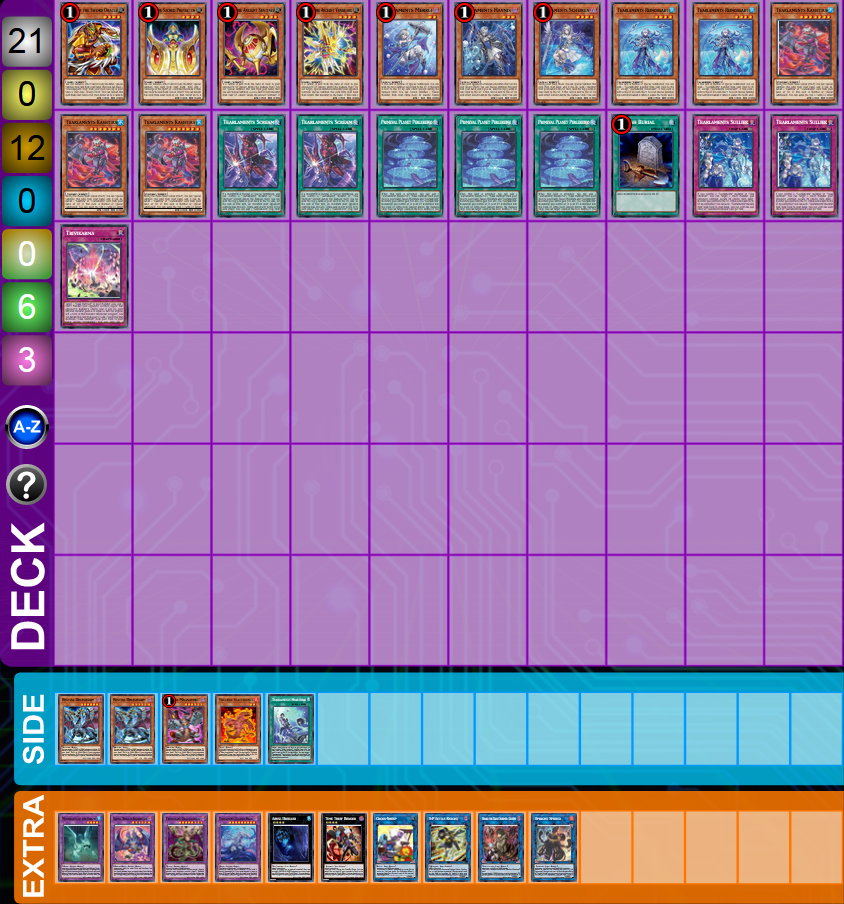
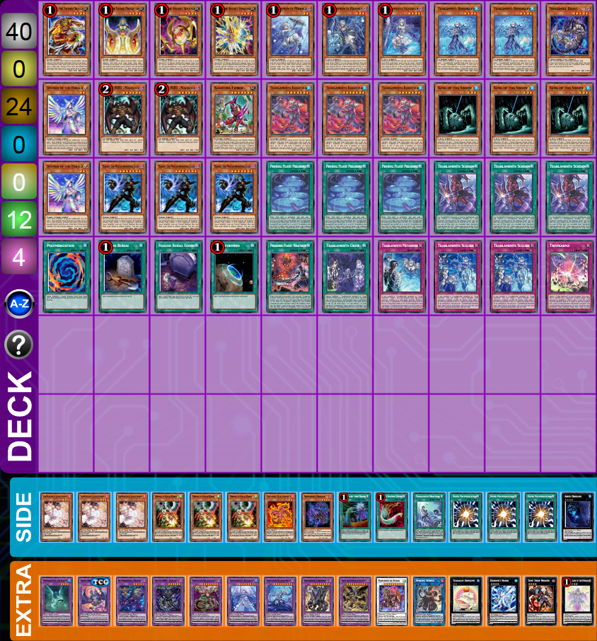

# Tearlaments

Last update: 2023-09-18 (after Arise-Heart ban).

- [Tearlaments](#tearlaments)
  - [Why play Tearlaments?](#why-play-tearlaments)
  - [Tearlaments core cards breackdown](#tearlaments-core-cards-breackdown)
  - [Versions](#versions)
    - [Hero](#hero-package)
    - [Toad](#toad-package)
    - [Winda](#winda-package)
    - [Shaddoll](#shaddoll)
    - [Revolution](#revolution)
    - [Budget](#budget-deck)
    - [Horus](#ocg-horus)
  - [Spicy cards](#spicy-cards)
  - [Sideboard](#sideboard-cards)
  - [Combos (videos)](#combos-videos)
  - [Test hands (videos)](#test-hands-videos)
  - [Cards against Tear](#cards-against-tear)
  - [Chainblocking](#chainblocking)
  - [How to beat Tear](#cards-against-tear)

## Why play Tearlaments?

You will enjoy this deck of you like to play non-linear tool-box decks. Given that almost all the cards in the deck are limited, you will need to improvise a lot and play around your own mills and hands. Your endboards will always vary depending on the cards you see in your rotation. This deck can also be considered as a semi-backrow deck because how strong its traps are and are always present in your board. Finally, this deck is its consistent and variable endboards. You will be always changing your final board depending on the version, on your hand/mills and on your opponent's deck. This gives a lot of flexibility and complexity to the deck.

## Tearlaments core cards breackdown

### The Tear girls

Each girl will allow you to make a fusion using themselves and another card in your hand, field or GY. This is the main idea of this deck: `You can Fusion Summon 1 Fusion Monster from your Extra Deck, by placing Fusion Materials mentioned on it from your hand, field, and/or GY, including this card from your GY, on the bottom of the Deck in any order.` Don't forget that all the girls are once per turn. So, maximum 3 fusions each turn! This will be easy to remember because they are all limited, but always keep it in mind.

Merrli is an okay normal summon that will mill you 3 cards. She is also a lvl2 monster, so you can pitch her with Spright Sprind.

A great Hand Trap that allows turn 0 plays to maybe make a Grapha, a Rullkalos or even a Winda.

The best of the sisters. She will not only mill 3 but also send another monster in your hand by effect, so it will activate it's effects when send to the GY. You can also pitch a brick like Malicious or a Shuffler.

### The other Tear monsters

Reino is your main starter that will help you pitching a girl for a fusion play, or TKash to mill 2. His second effect will come quite often to revive and activate the effect on summon (if you didn't activate it this turn). He is also your name for Tearlaments Kaleido-Heart and will make Rank-4 plays possible.

Havnis 2.0. TKash allows turn 0 plays too and is great to give consistency to this deck: you will mill on summon and when sent to GY. It is also searchable with Fenrir and Kashtira field spell. The only problem is that is not an Aqua nor a Dark monster.

### The Tear Spell/Trap

Perlereino is one of the best cards in this deck. It gives your Tear AND Fusion monsters an ATK boost, it searches when you activate it and can pop one card almost every turn. Your principal target will be Sheiren but sometimes it will be better to search for Reino or even TKash. A cool play will be to pop your own cards to get value from them. For example, pop your Kaleido-Heart, revive it and then `send 1 "Tearlaments" card from your Deck to the GY`.

Scream will help a lot with the consistency of your deck. It will allow you to mill 3 cards each turn, which is great for this deck. You will also use it as your principal chainblocker for your Normal Summons. You always want to see it, and even if you mill it, you are still gaining some advantages. The ATK modifier is also very relevant in lots of cases.

Grief is a Monster Reborn or a Foolish Burial in one card. It seems pretty great, but the problem is that you need to send one card with the same type or attribute from the tutored card, so in general you will send the same card you selected. It is also a good card to send to the GY, specially after banishing a Trap with TKash.

Heartbeat is a Spell/Trap removal that discards a card as effect (so it will trigger in the GY). What I really like about this, is that you shuffle back the card, so you don't give advantage to your opponent by sending it GY for example.

Probably the best backrow this deck could have; Sulliek **permanently** negates one Monster each turn, and sends your Tear monsters to the GY to activate their effect. Additionally, it tutors a Tear Monster when sent to the GY.

Metanoise is a Book of Moon and Foolish Burial when activated, and Monster Reincarnation when sent to the GY. This card is great to stop your opponent from going into Synchro, XYZ and Link plays (they will still be able to fuse using the face-down monster).

Cryme is an omni-negate with counter-trap speed (so your opponent can only chain to this activation with other counter-traps only) that discards a card as effect (so it will trigger in the GY). This trap can also recycle your banished Tear names (for example if you are playing against Bystials or your Runick opponent was lucky). Normally, you want to search this with Kaleido-Heart on turn 1 and set it.

### The Extra-deck monsters

Rullkallos has an included Solemn Warning that makes her terrifing. She can also revive (only once) by sending a Tear card from your field or hand to the GY. This can be pretty useful to pitch your Sulliek for example to search for TKash or even Havnis. It can also protect your Aqua monsters like Toad, the girls or even a Gameciel your opponent gave you.

The most terrifying monster to play against. Kaleido can spin any card on summon, this is very relevant against any deck. A typical combo would be to pop it during your turn with Perlereino (then it revives) to pitch a Scream to the GY and search for any Trap. You can also pitch Sulliek and search for Havnis or TKash. Finally, don't forget that it can't be used as a fusion material, meaning that the only way to shuffle it back is with your Shufflers or Metanoise.

Grapha is another scary boss monster. It's effect is almost an omni-negate that can unbrick your hand by sending Trivikarma or a Shuffler to the GY, or even trigger your important cards like the Millers or the Girls.

Chimera is principally here to unbrick you when you go first, or to make you win when you are going second. It is also bigger than Grapha and untargetable when Poly is in the GY.

Your best rank-4 monster that can steal imortant combo pieces from your opponent's deck, and trigger Sheiren's effect to fuse.

#### Make Rullkallos or Grapaha?

Normally, Grapha is better: he is bigger and can negate more things. He also triggers the card you will discard. But, in some cases you will need to do Rullkallos:

- If you will not have a card to discard with Grapha
- If you have one of the Spell/Traps that need a Tear name and you don't have a name in board (or Havnis/TKash in hand)
- If you know Rullkallos will be enough and you will gain more advantage of its revive
- If you need to protect your other Aqua monsters (specially Toad)

### The Ishizu cards

The worst of the Shufflers. Mudora is good to discard your Millers and to shuffle back cards from the GY.

Keldo is like a better Mudora. When you activate it's effect in hand you would be able to search for another Ishizu monster. I would recommend to get Kelbek for another interaction.

The worst of the Millers. It can monster reborn another Ishizu to make rank-4 plays, but it's mostly useful when sent to the GY to mill 5.

Kelbek has a crazy effect in hand and when sent to the GY. It is clearly the best of the Ishizu cards. Use it wisely, sometimes it's better to return a monster to the hand to interrupt your opponent's plays.

### The rest of the cards

Used to tutor for Poly and have access to your strong fusions.

This allows you to shuffle back your deck when you want to remove your girls from the bottom, and also, searches almost any Spell/Trap you need. You will never use the first effect, unless you play Visas, so this card is a brick in hand (but there are many ways to discard it).

#### Shuffle your deck when your girls are in the bottom

Wait until your names are in the bottom to shuffle your deck. You have many ways to shuffle it: Malicious, Beatrice, Shufflers, Trivikarma, Reino, Terraforming, Foolish, Foolish Goods... This is mostly important when you make Garura with two girls or when you make two fusions back-to-back. You need to put the girls back in any order in your deck; if they are in the bottom you know you will never see them anymore.

### Core cards

You can reduce Reino to minimum **2** if you add some **Diviner of the Herald**s.

## Versions

### Hero package

Gives access to Beatrice to pitch any card you need.

### Toad package

Gives access to another omni negate that is an Aqua (to make Kaleido), that can recycle Reino or TKash and also is protected with Rullkalos.

### Winda package

Gives access to a strong floodgate that can't be destroyed by your opponent's card effects.

#### Some examples of decks

### Shaddoll

The objective of this version is to always garantee a Winda. It takes lots of places on your extra deck, but its pretty consistent. You will play the Winda package + some extra cards. See the combo in the [combo section](#shaddoll-combo).

### Revolution

This version can almost always guarantee a fieldspell (with Ancient Fairy then Amritara). It can also make a two card combo with Revolution and Fenrir. See the combo in the [combo section](#revolution-combo).

### Budget deck

For this version I have cut the big cards: Fieldspells, Fenrir, Guardian Chimera, Garura, Superpoly. Tearlaments Kashtira is quite expensive too but it's mandatory. I've also added one Perlereino because it's super strong, but you can replace it and Terraforming with more Dangers for example.

### OCG Horus

The Horus support will be good for this deck. You can already try it out. Here is an example of the deck:

## Spicy cards

Here is a list of spicy cards you can consider to your build.

## Sideboard cards

Here is a list of sideboard cards to consider. The ratios is up to you to determine.

## Combos (videos)

### Dracossack - Cherubini - Sprind

With only Fenrir and a card to special summon TKash, you are able to send King of the Swamp and Merrli to the GY. Any other card you mill or you have in hand, are extenders.

<https://www.duelingbook.com/replay?id=1000060-52664570>

### Example of endboard with Beatrice and Winda

Ideally it can be bigger depending on your mills but the objective is simple: pitch Beast in your turn and make Winda in your opponent's turn.

<https://www.duelingbook.com/replay?id=1000060-52619551>

### Example of endboard with Cross-Sheep and Redoer

On your opponent's turn, you can fuse (with Sheiren). Put the fusion under Cross-Sheep. Then activate Sheep effect: revive Reino and continue...

<https://www.duelingbook.com/replay?id=1000060-52665106>

### Revolution combo

If you are playing the Revolution version, you can make a big board using only Fenrir and Revolution Synchron. In this case I was very lucky with all my follow-up and cards, but even without that Sheiren in hand I guarantee myself a Baronne and a mill 5 with TKash.

<https://www.duelingbook.com/replay?id=1000060-52619657>

### Shaddoll combo

The general idea is to take Schism with Apkallone and make the most useful fusion during your opponent's turn.

<https://www.duelingbook.com/replay?id=1000060-52664963>

### Shaddoll combo, how to make Baronne

The general idea is to use Cross-Shepp to revive Falco or Diviner, then make Baronne by using Construct or Granguignol.

<https://www.duelingbook.com/replay?id=1000060-52664847>

### Destrudo in GY combo

So, you normally want a lvl4 and a lvl7 on board. You target the lvl4 monster and summon Destrudo as a lvl3. Then you make Baronne. If you are playing lvl7 synchros you can also target any monster and make any synchro-7 with it:

- Target a lvl2 -> Destrudo becomes a lvl5 -> 2 + 5 = 7
- Target a lvl3 -> Destrudo becomes a lvl4 -> 3 + 4 = 7
- Target a lvl4 -> Destrudo becomes a lvl3 -> 4 + 3 = 7
- Target a lvl5 -> Destrudo becomes a lvl2 -> 5 + 2 = 7
- Target a lvl6 -> Destrudo becomes a lvl1 -> 6 + 1 = 7

<https://www.duelingbook.com/replay?id=1000060-52677412>

## Test hands (videos)

### 1. Opponent Ashes my Fenrir

In this example, I have two choices:

- I keep Fenrir, set Book of Moon and pass.
- I gamble and make Guardian Chimera to mill 2 and draw 1 (in this case, it wasn't very good).

<https://www.duelingbook.com/replay?id=1000060-52665159>

### 2. Opponent Ashes my Sheiren

In this example I was lucky and had Poly, so I could make Guardian Chimera and continue. I also gambled when I chained CL1 Sheiren and CL2 Agido; if I would have hit nothing, I would have been obligated to fuse Sheiren + Guardian Chimera into Dragostapelia. Luckyly I hit a King of the Swamp. Also, I decided to make Grapha to get rid of my Trivikarma in hand, and also, I knew that I will have a Tear name online because I milled Sulliek (so I searched for TKash). Finally, I decided to get Metanoise, because I prefer to pitch a girl than to randomly mill 2.

<https://www.duelingbook.com/replay?id=1000060-52665413>

### 3. Simple test hand finishing on Fenrir + Toad + follow-up

<https://www.duelingbook.com/replay?id=1000060-52665298>

### 4. Okay board with the Synchron version

<https://www.duelingbook.com/replay?id=1000060-52665534>

## Chainblocking

### Chainblocking Belle

When you mill a girl and another card that has an effect when send to the GY, you can CL1 the girl and CL2 that other card to protect your effect that will fusion summon from Ghost Belle.

### Chainblocking Ash

Protect your most important mill/search by putting it in CL1. For example, if you have a TKash mill and an Agido mill, put Agido in CL1 in case your opponent Ashes you.

## Cards against Tear

### Cards that hurt a lot

If you start and they Shifter you, just try to make Fenrir pass. |

 

You can always return the girls from banish with Cryme.

Try to make Fenrir and/or to make Redoer and kill the Dweller, so you can fuse next turn.

Don't forget to trigger Perlereino if applicable.

Just make Redoer or Baronne.

### Cards that hurt

You can always return the banishged card with Cryme or Grief.

You can always chainblock her.

You can get the traps back if you mill Grief.

If they use Gameciel on you, don't forget that they can't kill it if you have Rullkallos. If they use Sphere, you need to get rid of that asap.

Can clean the frontrow, but you have the backrow. You can always send the monsters with Sulliek.

Just use Grapha, Toad or Baronne. If the Evenly Matched passes, keep your biggest threat.

You can always protect you with Toad or Baronne. Don't forget that you **can** use your face-down monsters for fusions.

### Cards that hurt a bit

Few cards search in this deck: King of the Swamp, Terraforming, both Planets, Fenrir, Sulliek and Scream. Always respect Droll and play the most important one first (but be aware that you can get Ashed).

They can't negate Sheiren, Havnis nor TKash effect in hand, because Veiler/Mourner/Imperm negate on field. But they can negate the mill 3 of TKash or the foolish of Reino/Diviner.

Nib will trigger your monsters that will be sent to the GY. If you want to play around try to put quickly on play Toad, Rullakllos, Grapha or Baronne. Don't forget that the token is a Light monster. It might be relevant for Super Poly.

| 

Hurts, but they will trigger your effects on GY. Respect Lighning Storm by putting your guys in defense.
